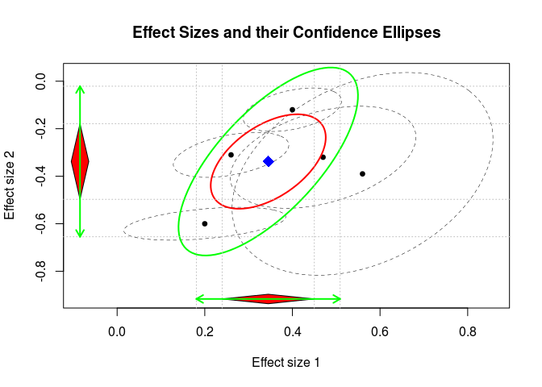

# The metaSEM package
Mike Cheung  
`r format(Sys.time(), '%d %B, %Y')`  


# Introduction
* The `metaSEM` package provides functions to conducting univariate and multivariate meta-analysis using a structural equation modeling approach via the [OpenMx](http://openmx.psyc.virginia.edu/) package. It also implemented the two-stage structural equation modeling (TSSEM) approach to conducting fixed- and random-effects meta-analytic structural equation modeling (MASEM) on correlation/covariance matrices. 

* The `metaSEM` package is based on the following papers:
    + Cheung, M.W.-L. (2008). A model for integrating fixed-, random-, and mixed-effects meta-analyses into structural equation modeling. _Psychological Methods_, _13_, 182-202.
    + Cheung, M.W.-L. (2009). Constructing approximate confidence intervals for parameters with structural equation models. _Structural Equation Modeling_, _16_, 267–294.
    + Cheung, M.W.-L. (2010). Fixed-effects meta-analyses as multiple-group structural equation models. _Structural Equation Modeling_, _17_, 481-509.
    + Cheung, M.W.-L. (2013). Implementing restricted maximum likelihood estimation in structural equation models. _Structural Equation Modeling_, _20_, 157-167.
    + Cheung, M.W.-L. (2013). Multivariate meta-analysis as structural equation models. _Structural Equation Modeling_, _20_, 429-454. 
    + Cheung, M.W.-L. (2014). MetaSEM: an R package for meta-analysis using structural equation modeling. _Frontiers in Psychology_, _5 (1521)_.
    + Cheung, M.W.-L. (2014). Fixed- and random-effects meta-analytic structural equation modeling: Examples and analyses in R. _Behavior Research Methods_, _46_, 29-40. 
    + Cheung, M.W.-L. (2014). Modeling dependent effect sizes with three-level meta-analyses: A structural equation modeling approach. _Psychological Methods_, _19_, 211-229.
    + Cheung, M.W.-L. (2015). Meta-Analysis: A Structural Equation Modeling Approach. [Wiley](http://as.wiley.com/WileyCDA/WileyTitle/productCd-1119993431.html). 
    + Cheung, M.W.-L., & Chan, W. (2004). Testing dependent correlation coefficients via structural equation modeling. _Organizational Research Methods_, _7_, 206–223.
    + Cheung, M.W.-L., & Chan, W. (2005). Meta-analytic structural equation modeling: A two-stage approach. _Psychological Methods_, _10_, 40-64.
    + Cheung, M.W.-L., & Chan, W. (2009). A two-stage approach to synthesizing covariance matrices in meta-analytic structural equation modeling. _Structural Equation Modeling_, _6_, 28-53.

# Examples
## Univariate meta-analysis
### Random-effects model

```r
## Load the library
library(metaSEM)

## Show the first few studies of the data set
head(Becker83)
```

```
  study    di   vi percentage items
1     1 -0.33 0.03         25     2
2     2  0.07 0.03         25     2
3     3 -0.30 0.02         50     2
4     4  0.35 0.02        100    38
5     5  0.69 0.07        100    30
6     6  0.81 0.22        100    45
```

```r
## Random-effects meta-analysis with ML
summary( meta(y=di, v=vi, data=Becker83) )
```

```

Call:
meta(y = di, v = vi, data = Becker83)

95% confidence intervals: z statistic approximation
Coefficients:
            Estimate Std.Error    lbound    ubound z value Pr(>|z|)
Intercept1  0.174734  0.113378 -0.047482  0.396950  1.5412   0.1233
Tau2_1_1    0.077376  0.054108 -0.028674  0.183426  1.4300   0.1527

Q statistic on the homogeneity of effect sizes: 30.64949
Degrees of freedom of the Q statistic: 9
P value of the Q statistic: 0.0003399239

Heterogeneity indices (based on the estimated Tau2):
                             Estimate
Intercept1: I2 (Q statistic)   0.6718

Number of studies (or clusters): 10
Number of observed statistics: 10
Number of estimated parameters: 2
Degrees of freedom: 8
-2 log likelihood: 7.928307 
OpenMx status1: 0 ("0" or "1": The optimization is considered fine.
Other values may indicate problems.)
```

### Fixed-effects model

```r
## Fixed-effects meta-analysis by fixiing the heterogeneity variance at 0
summary( meta(y=di, v=vi, data=Becker83, RE.constraints=0) )
```

```

Call:
meta(y = di, v = vi, data = Becker83, RE.constraints = 0)

95% confidence intervals: z statistic approximation
Coefficients:
            Estimate Std.Error    lbound    ubound z value Pr(>|z|)  
Intercept1  0.100640  0.060510 -0.017957  0.219237  1.6632  0.09627 .
---
Signif. codes:  0 '***' 0.001 '**' 0.01 '*' 0.05 '.' 0.1 ' ' 1

Q statistic on the homogeneity of effect sizes: 30.64949
Degrees of freedom of the Q statistic: 9
P value of the Q statistic: 0.0003399239

Heterogeneity indices (based on the estimated Tau2):
                             Estimate
Intercept1: I2 (Q statistic)        0

Number of studies (or clusters): 10
Number of observed statistics: 10
Number of estimated parameters: 1
Degrees of freedom: 9
-2 log likelihood: 17.86043 
OpenMx status1: 0 ("0" or "1": The optimization is considered fine.
Other values may indicate problems.)
```

### Mixed-effects model

```r
## Mixed-effects meta-analysis with "log(items)" as the predictor
summary( meta(y=di, v=vi, x=log(items), data=Becker83) ) 
```

```

Call:
meta(y = di, v = vi, x = log(items), data = Becker83)

95% confidence intervals: z statistic approximation
Coefficients:
              Estimate   Std.Error      lbound      ubound z value
Intercept1 -3.2015e-01  1.0981e-01 -5.3539e-01 -1.0492e-01 -2.9154
Slope1_1    2.1088e-01  4.5084e-02  1.2251e-01  2.9924e-01  4.6774
Tau2_1_1    1.0000e-10  2.0095e-02 -3.9386e-02  3.9386e-02  0.0000
            Pr(>|z|)    
Intercept1  0.003552 ** 
Slope1_1   2.905e-06 ***
Tau2_1_1    1.000000    
---
Signif. codes:  0 '***' 0.001 '**' 0.01 '*' 0.05 '.' 0.1 ' ' 1

Q statistic on the homogeneity of effect sizes: 30.64949
Degrees of freedom of the Q statistic: 9
P value of the Q statistic: 0.0003399239

Explained variances (R2):
                           y1
Tau2 (no predictor)    0.0774
Tau2 (with predictors) 0.0000
R2                     1.0000

Number of studies (or clusters): 10
Number of observed statistics: 10
Number of estimated parameters: 3
Degrees of freedom: 7
-2 log likelihood: -4.208024 
OpenMx status1: 0 ("0" or "1": The optimization is considered fine.
Other values may indicate problems.)
```

## Multivariate meta-analysis
### Random-effects model

```r
## Show the data set
Berkey98
```

```
  trial pub_year no_of_patients   PD    AL var_PD cov_PD_AL var_AL
1     1     1983             14 0.47 -0.32 0.0075    0.0030 0.0077
2     2     1982             15 0.20 -0.60 0.0057    0.0009 0.0008
3     3     1979             78 0.40 -0.12 0.0021    0.0007 0.0014
4     4     1987             89 0.26 -0.31 0.0029    0.0009 0.0015
5     5     1988             16 0.56 -0.39 0.0148    0.0072 0.0304
```

```r
## Multivariate meta-analysis with a random-effects model
mult1 <- meta(y=cbind(PD, AL), v=cbind(var_PD, cov_PD_AL, var_AL), data=Berkey98) 

summary(mult1)
```

```

Call:
meta(y = cbind(PD, AL), v = cbind(var_PD, cov_PD_AL, var_AL), 
    data = Berkey98)

95% confidence intervals: z statistic approximation
Coefficients:
             Estimate  Std.Error     lbound     ubound z value  Pr(>|z|)
Intercept1  0.3448392  0.0536312  0.2397239  0.4499544  6.4298 1.278e-10
Intercept2 -0.3379381  0.0812480 -0.4971812 -0.1786951 -4.1593 3.192e-05
Tau2_1_1    0.0070020  0.0090497 -0.0107351  0.0247391  0.7737    0.4391
Tau2_2_1    0.0094607  0.0099698 -0.0100797  0.0290010  0.9489    0.3427
Tau2_2_2    0.0261445  0.0177409 -0.0086270  0.0609161  1.4737    0.1406
              
Intercept1 ***
Intercept2 ***
Tau2_1_1      
Tau2_2_1      
Tau2_2_2      
---
Signif. codes:  0 '***' 0.001 '**' 0.01 '*' 0.05 '.' 0.1 ' ' 1

Q statistic on the homogeneity of effect sizes: 128.2267
Degrees of freedom of the Q statistic: 8
P value of the Q statistic: 0

Heterogeneity indices (based on the estimated Tau2):
                             Estimate
Intercept1: I2 (Q statistic)   0.6021
Intercept2: I2 (Q statistic)   0.9250

Number of studies (or clusters): 5
Number of observed statistics: 10
Number of estimated parameters: 5
Degrees of freedom: 5
-2 log likelihood: -11.68131 
OpenMx status1: 0 ("0" or "1": The optimization is considered fine.
Other values may indicate problems.)
```

```r
## Plot the effect sizes
plot(mult1)
```

 

```r
## Plot the effect sizes with the forest plots
## Load the library for forest plots 
library("metafor")

## Create extra panels for the forest plots
plot(mult1, diag.panel=TRUE, main="Multivariate meta-analysis",
axis.label=c("PD", "AL"))

## Forest plot for PD
forest( rma(yi=PD, vi=var_PD, data=Berkey98) )
title("Forest plot of PD")

## Forest plot for AL
forest( rma(yi=AL, vi=var_AL, data=Berkey98) )
title("Forest plot of AL")
```

 

### Fixed-effects model

```r
## Fixed-effects meta-analysis by fixiing the heterogeneity variance component at 
## a 2x2 matrix of 0.
summary( meta(y=cbind(PD, AL), v=cbind(var_PD, cov_PD_AL, var_AL), data=Berkey98,
              RE.constraints=matrix(0, nrow=2, ncol=2)) )
```

```

Call:
meta(y = cbind(PD, AL), v = cbind(var_PD, cov_PD_AL, var_AL), 
    data = Berkey98, RE.constraints = matrix(0, nrow = 2, ncol = 2))

95% confidence intervals: z statistic approximation
Coefficients:
            Estimate Std.Error    lbound    ubound z value  Pr(>|z|)    
Intercept1  0.307219  0.028575  0.251212  0.363225  10.751 < 2.2e-16 ***
Intercept2 -0.394377  0.018649 -0.430929 -0.357825 -21.147 < 2.2e-16 ***
---
Signif. codes:  0 '***' 0.001 '**' 0.01 '*' 0.05 '.' 0.1 ' ' 1

Q statistic on the homogeneity of effect sizes: 128.2267
Degrees of freedom of the Q statistic: 8
P value of the Q statistic: 0

Heterogeneity indices (based on the estimated Tau2):
                             Estimate
Intercept1: I2 (Q statistic)        0
Intercept2: I2 (Q statistic)        0

Number of studies (or clusters): 5
Number of observed statistics: 10
Number of estimated parameters: 2
Degrees of freedom: 8
-2 log likelihood: 90.88326 
OpenMx status1: 0 ("0" or "1": The optimization is considered fine.
Other values may indicate problems.)
```

### Mixed-effects model

```r
## Multivariate meta-analysis with "publication year-1979" as a predictor 
summary( meta(y=cbind(PD, AL), v=cbind(var_PD, cov_PD_AL, var_AL), data=Berkey98,
              x=scale(pub_year, center=1979)) )
```

```

Call:
meta(y = cbind(PD, AL), v = cbind(var_PD, cov_PD_AL, var_AL), 
    x = scale(pub_year, center = 1979), data = Berkey98)

95% confidence intervals: z statistic approximation
Coefficients:
             Estimate  Std.Error     lbound     ubound z value  Pr(>|z|)
Intercept1  0.3440001  0.0857659  0.1759020  0.5120982  4.0109 6.048e-05
Intercept2 -0.2918175  0.1312797 -0.5491209 -0.0345140 -2.2229   0.02622
Slope1_1    0.0063540  0.1078235 -0.2049762  0.2176842  0.0589   0.95301
Slope2_1   -0.0705888  0.1620966 -0.3882922  0.2471147 -0.4355   0.66322
Tau2_1_1    0.0080405  0.0101206 -0.0117955  0.0278766  0.7945   0.42692
Tau2_2_1    0.0093413  0.0105515 -0.0113392  0.0300218  0.8853   0.37599
Tau2_2_2    0.0250135  0.0170788 -0.0084603  0.0584873  1.4646   0.14303
              
Intercept1 ***
Intercept2 *  
Slope1_1      
Slope2_1      
Tau2_1_1      
Tau2_2_1      
Tau2_2_2      
---
Signif. codes:  0 '***' 0.001 '**' 0.01 '*' 0.05 '.' 0.1 ' ' 1

Q statistic on the homogeneity of effect sizes: 128.2267
Degrees of freedom of the Q statistic: 8
P value of the Q statistic: 0

Explained variances (R2):
                              y1     y2
Tau2 (no predictor)    0.0070020 0.0261
Tau2 (with predictors) 0.0080405 0.0250
R2                     0.0000000 0.0433

Number of studies (or clusters): 5
Number of observed statistics: 10
Number of estimated parameters: 7
Degrees of freedom: 3
-2 log likelihood: -12.00859 
OpenMx status1: 0 ("0" or "1": The optimization is considered fine.
Other values may indicate problems.)
```

## More examples
* [Three-level meta-analysis](./3level.html)
* [Meta-analytic structural equation modeling](./masem.html)

# Installation and help
* First of most important, you need [R](http://www.r-project.org/) to run it. You can install the `metaSEM` package by running the following command inside an `R` session:

```
install.packages("metaSEM")
```

* The developmental version can be installed from [GitHub](https://github.com/mikewlcheung/metasem) by running:

```
library(devtools)
install_github("mikewlcheung/metasem")
```

## Potential issues with the OpenMx available at CRAN
* The OpenMx available at [CRAN](http://cran.r-project.org/web/packages/OpenMx/) includes only the open source `SLSQP` optimizer. 
* If the `SLSQP` optimizer does not work well for you, e.g., there are many error codes, you may try to rerun the analysis. For example,

```
random1 <- meta(y=yi, v=vi, data=Hox02)
random1 <- rerun(random1)
summary(random1)
```
* If you still prefer the non-free `NPSOL` optimizer, you may install it from the [OpenMx website](http://openmx.psyc.virginia.edu/) and call it by running:

```
mxOption(NULL, "Default optimizer", "NPSOL")
```

## Help
* [Reference manual](./manual/index.html)
* [Vignette](https://dl.dropboxusercontent.com/u/25182759/metaSEM.pdf)
* If you need help,
  	 + **[OpenMx discussion forum](http://openmx.psyc.virginia.edu/forums/third-party-software/metasem)**: A discussion forum for the `metaSEM` package in `OpenMx`. You may post technical questions related to `metaSEM` there. Please include information on the session. It will be helpful if you can include a reproducible example. You may save a copy of your data, say `my.df`, and attach the content of `myData.R` in the post by using
```
sessionInfo()
dump(c("my.df"), file="myData.R")
```
	+ **[Meta-analysis resources](http://meta-analysis.ning.com/group/meta-analytic-structural-equation-modeling?xg_source=activity)**: A discussion forum related to the conceptual issues of meta-analytic structural equation modeling.

The files are based on the following versions of `R` and `R` packages:

```r
sessionInfo()
```

```
Warning in readLines("/etc/os-release"): incomplete final line found on '/
etc/os-release'
```

```
R version 3.2.0 (2015-04-16)
Platform: x86_64-unknown-linux-gnu (64-bit)
Running under: Linux Mint LMDE

locale:
 [1] LC_CTYPE=en_US.UTF-8       LC_NUMERIC=C              
 [3] LC_TIME=en_US.UTF-8        LC_COLLATE=en_US.UTF-8    
 [5] LC_MONETARY=en_US.UTF-8    LC_MESSAGES=en_US.UTF-8   
 [7] LC_PAPER=en_US.UTF-8       LC_NAME=C                 
 [9] LC_ADDRESS=C               LC_TELEPHONE=C            
[11] LC_MEASUREMENT=en_US.UTF-8 LC_IDENTIFICATION=C       

attached base packages:
[1] parallel  stats     graphics  grDevices utils     datasets  methods  
[8] base     

other attached packages:
[1] metafor_1.9-7   Matrix_1.2-1    metaSEM_0.9.4   OpenMx_2.2.4   
[5] MASS_7.3-40     digest_0.6.8    knitr_1.10.5    rmarkdown_0.6.1

loaded via a namespace (and not attached):
 [1] lattice_0.20-31 grid_3.2.0      formatR_1.2     magrittr_1.5   
 [5] evaluate_0.7    stringi_0.4-1   tools_3.2.0     stringr_1.0.0  
 [9] yaml_2.1.13     htmltools_0.2.6
```
