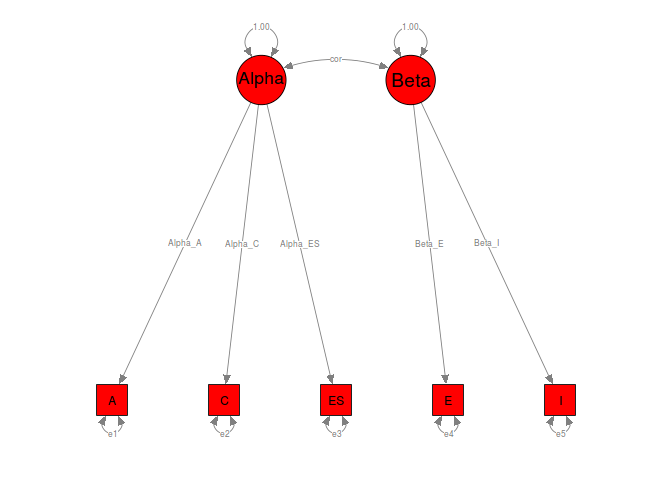
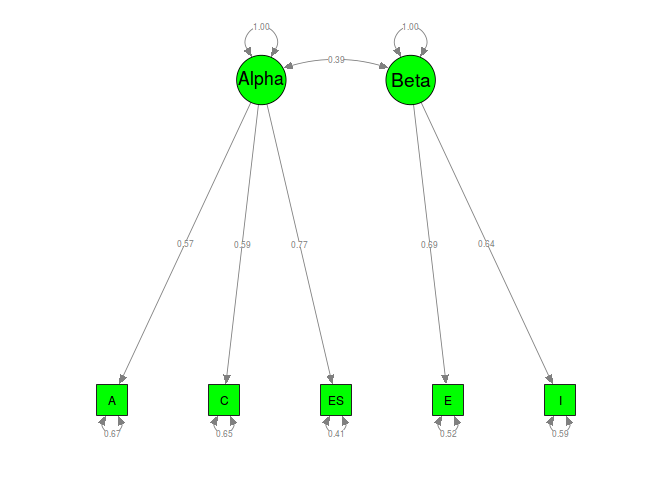
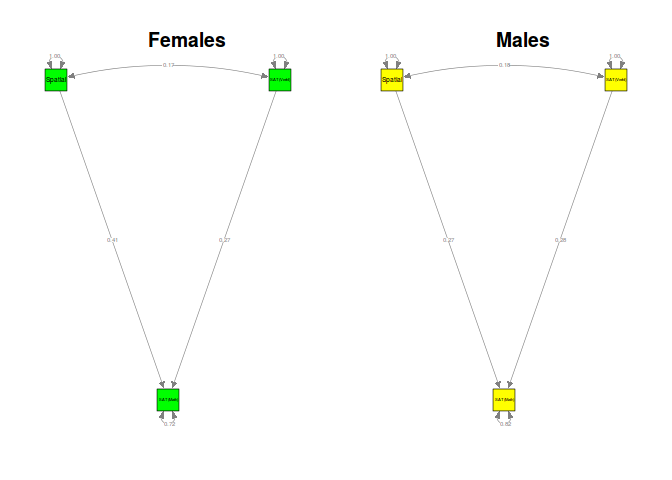
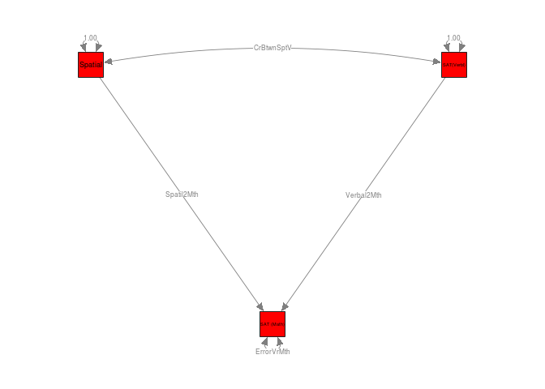
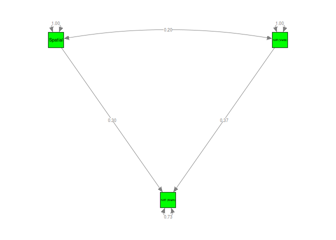

# Examples of MASEM
Mike Cheung  
`r format(Sys.time(), '%d %B, %Y')`  


# Digman (1997)
## Inspect the data
The correlation matrices and the sample sizes were stored in `Digman97$data` and `Digman97$n`, respectively. We may list the first few cases of the data by using the `head()` command.

```r
  #### Load the metaSEM library for TSSEM
  library(metaSEM)
  
  #### Inspect the data for inspection
  head(Digman97$data)
```

```
$`Digman 1 (1994)`
       A     C   ES     E    I
A   1.00  0.62 0.41 -0.48 0.00
C   0.62  1.00 0.59 -0.10 0.35
ES  0.41  0.59 1.00  0.27 0.41
E  -0.48 -0.10 0.27  1.00 0.37
I   0.00  0.35 0.41  0.37 1.00

$`Digman 2 (1994)`
       A    C   ES     E     I
A   1.00 0.39 0.53 -0.30 -0.05
C   0.39 1.00 0.59  0.07  0.44
ES  0.53 0.59 1.00  0.09  0.22
E  -0.30 0.07 0.09  1.00  0.45
I  -0.05 0.44 0.22  0.45  1.00

$`Digman 3 (1963c)`
      A     C   ES     E    I
A  1.00  0.65 0.35  0.25 0.14
C  0.65  1.00 0.37 -0.10 0.33
ES 0.35  0.37 1.00  0.24 0.41
E  0.25 -0.10 0.24  1.00 0.41
I  0.14  0.33 0.41  0.41 1.00

$`Digman & Takemoto-Chock (1981b)`
       A     C   ES     E     I
A   1.00  0.65 0.70 -0.26 -0.03
C   0.65  1.00 0.71 -0.16  0.24
ES  0.70  0.71 1.00  0.01  0.11
E  -0.26 -0.16 0.01  1.00  0.66
I  -0.03  0.24 0.11  0.66  1.00

$`Graziano & Ward (1992)`
      A    C   ES    E    I
A  1.00 0.64 0.35 0.29 0.22
C  0.64 1.00 0.27 0.16 0.22
ES 0.35 0.27 1.00 0.32 0.36
E  0.29 0.16 0.32 1.00 0.53
I  0.22 0.22 0.36 0.53 1.00

$`Yik & Bond (1993)`
      A    C   ES    E    I
A  1.00 0.66 0.57 0.35 0.38
C  0.66 1.00 0.45 0.20 0.31
ES 0.57 0.45 1.00 0.49 0.31
E  0.35 0.20 0.49 1.00 0.59
I  0.38 0.31 0.31 0.59 1.00
```

```r
  head(Digman97$n)
```

```
[1] 102 149 334 162  91 656
```

## Fixed-effects TSSEM
### Stage 1 analysis
To conduct a fixed-effects TSSEM, we may specify `method=FEM` argument (the default method) in calling the `tssem1()` function. The results are stored in an object named `fixed1`. It can be displayed by the `summary()` command. The $\chi^2(130, N=4,496) = 1,499.73, p < .001$, CFI=0.6825, RMSEA=0.1812 and SRMR=0.1750. Based on the test statistic and the goodness-of-fit indices, the assumption of homogeneity of correlation matrices was rejected. 

```r
## Fixed-effects model: Stage 1 analysis
fixed1 <- tssem1(my.df=Digman97$data, n=Digman97$n, method="FEM")
summary(fixed1)
```

```

Call:
tssem1FEM(my.df = my.df, n = n, cor.analysis = cor.analysis, 
    model.name = model.name, cluster = cluster, suppressWarnings = suppressWarnings, 
    silent = silent, run = run)

Coefficients:
       Estimate Std.Error z value  Pr(>|z|)    
S[1,2] 0.363116  0.013391 27.1170 < 2.2e-16 ***
S[1,3] 0.390176  0.012903 30.2387 < 2.2e-16 ***
S[1,4] 0.103751  0.015070  6.8846 5.797e-12 ***
S[1,5] 0.092246  0.015071  6.1207 9.316e-10 ***
S[2,3] 0.415999  0.012540 33.1732 < 2.2e-16 ***
S[2,4] 0.135208  0.014799  9.1362 < 2.2e-16 ***
S[2,5] 0.141213  0.014890  9.4835 < 2.2e-16 ***
S[3,4] 0.244505  0.014175 17.2487 < 2.2e-16 ***
S[3,5] 0.138167  0.014858  9.2993 < 2.2e-16 ***
S[4,5] 0.424514  0.012396 34.2468 < 2.2e-16 ***
---
Signif. codes:  0 '***' 0.001 '**' 0.01 '*' 0.05 '.' 0.1 ' ' 1

Goodness-of-fit indices:
                                     Value
Sample size                      4496.0000
Chi-square of target model       1499.7340
DF of target model                130.0000
p value of target model             0.0000
Chi-square of independence model 4454.5995
DF of independence model          140.0000
RMSEA                               0.1812
SRMR                                0.1620
TLI                                 0.6581
CFI                                 0.6825
AIC                              1239.7340
BIC                               406.3114
OpenMx status1: 0 ("0" or "1": The optimization is considered fine.
Other values indicate problems.)
```

The pooled correlation matrix (the parameter estimates) can be extracted by the use of the `coef()` command.

```r
coef(fixed1)
```

```
           x1        x2        x3        x4         x5
x1 1.00000000 0.3631157 0.3901765 0.1037511 0.09224586
x2 0.36311572 1.0000000 0.4159987 0.1352076 0.14121296
x3 0.39017648 0.4159987 1.0000000 0.2445051 0.13816688
x4 0.10375112 0.1352076 0.2445051 1.0000000 0.42451421
x5 0.09224586 0.1412130 0.1381669 0.4245142 1.00000000
```

### Stage 2 analysis
As an illustration, I continued to fit the structural model based on the pooled correlation matrix. We may specify the two-factor model with the [RAM formulation](http://openmx.psyc.virginia.edu/docs/OpenMx/latest/Examples_Matrix.html)

```r
## Factor covariance among latent factors
Phi <- matrix(c(1,"0.3*cor","0.3*cor",1), ncol=2, nrow=2)

## Error covariance matrix
Psi <- Diag(c("0.2*e1","0.2*e2","0.2*e3","0.2*e4","0.2*e5"))

## S matrix
S1 <- bdiagMat(list(Psi, Phi))

## This step is not necessary but it is useful for inspecting the model.
dimnames(S1)[[1]] <- dimnames(S1)[[2]] <- c("A","C","ES","E","I","Alpha","Beta") 

## Display S1
S1
```

```
      A        C        ES       E        I        Alpha     Beta     
A     "0.2*e1" "0"      "0"      "0"      "0"      "0"       "0"      
C     "0"      "0.2*e2" "0"      "0"      "0"      "0"       "0"      
ES    "0"      "0"      "0.2*e3" "0"      "0"      "0"       "0"      
E     "0"      "0"      "0"      "0.2*e4" "0"      "0"       "0"      
I     "0"      "0"      "0"      "0"      "0.2*e5" "0"       "0"      
Alpha "0"      "0"      "0"      "0"      "0"      "1"       "0.3*cor"
Beta  "0"      "0"      "0"      "0"      "0"      "0.3*cor" "1"      
```

```r
## A matrix
Lambda <-
matrix(c(".3*Alpha_A",".3*Alpha_C",".3*Alpha_ES",rep(0,5),".3*Beta_E",".3*Beta_I"),
       ncol=2, nrow=5)
A1 <- rbind( cbind(matrix(0,ncol=5,nrow=5), Lambda),
             matrix(0, ncol=7, nrow=2) )

## This step is not necessary but it is useful for inspecting the model.
dimnames(A1)[[1]] <- dimnames(A1)[[2]] <- c("A","C","ES","E","I","Alpha","Beta") 

## Display A1
A1
```

```
      A   C   ES  E   I   Alpha         Beta       
A     "0" "0" "0" "0" "0" ".3*Alpha_A"  "0"        
C     "0" "0" "0" "0" "0" ".3*Alpha_C"  "0"        
ES    "0" "0" "0" "0" "0" ".3*Alpha_ES" "0"        
E     "0" "0" "0" "0" "0" "0"           ".3*Beta_E"
I     "0" "0" "0" "0" "0" "0"           ".3*Beta_I"
Alpha "0" "0" "0" "0" "0" "0"           "0"        
Beta  "0" "0" "0" "0" "0" "0"           "0"        
```

```r
## F matrix to select the observed variables
F1 <- create.Fmatrix(c(1,1,1,1,1,0,0), as.mxMatrix=FALSE)

## Display F1
F1
```

```
     [,1] [,2] [,3] [,4] [,5] [,6] [,7]
[1,]    1    0    0    0    0    0    0
[2,]    0    1    0    0    0    0    0
[3,]    0    0    1    0    0    0    0
[4,]    0    0    0    1    0    0    0
[5,]    0    0    0    0    1    0    0
```
 
Since we are conducting a correlation structure analysis, the error variances are not free parameters. We need to use the `diag.constraints` to constrain the diagonals as one. When there are nonlinear constraints, standard errors are not available in `OpenMx`. We may request the likelihood-based confidence intervals (LBCI) with the `intervals` argument.
The chi-square test statistic of the Stage 2 analysis was $\chi^2(4, N=4,496) = 65.06, p < .001$, CFI=0.9802, RMSEA=0.0583 and SRMR=0.0284.

```r
fixed2 <- tssem2(fixed1, Amatrix=A1, Smatrix=S1, Fmatrix=F1, 
                 diag.constraints=TRUE, intervals="LB",
                 model.name="TSSEM2 Digman97")
summary(fixed2)
```

```

Call:
wls(Cov = pooledS, asyCov = tssem1.obj$acovS, n = sum(tssem1.obj$n), 
    Amatrix = Amatrix, Smatrix = Smatrix, Fmatrix = Fmatrix, 
    diag.constraints = diag.constraints, cor.analysis = cor.analysis, 
    intervals.type = intervals.type, mx.algebras = mx.algebras, 
    model.name = model.name, suppressWarnings = suppressWarnings, 
    silent = silent, run = run)

95% confidence intervals: Likelihood-based statistic
Coefficients:
         Estimate Std.Error  lbound  ubound z value Pr(>|z|)
Alpha_A   0.56258        NA 0.53242 0.59286      NA       NA
Alpha_C   0.60513        NA 0.57509 0.63532      NA       NA
Alpha_ES  0.71913        NA 0.68863 0.75032      NA       NA
Beta_E    0.78200        NA 0.71911 0.85587      NA       NA
Beta_I    0.55089        NA 0.49939 0.60231      NA       NA
e1        0.68351        NA 0.64851 0.71653      NA       NA
e2        0.63382        NA 0.59636 0.66927      NA       NA
e3        0.48285        NA 0.43702 0.52580      NA       NA
e4        0.38847        NA 0.26741 0.48290      NA       NA
e5        0.69652        NA 0.63721 0.75061      NA       NA
cor       0.36261        NA 0.31842 0.40650      NA       NA

Goodness-of-fit indices:
                                               Value
Sample size                                4496.0000
Chi-square of target model                   65.0605
DF of target model                            4.0000
p value of target model                       0.0000
Number of constraints imposed on "Smatrix"    5.0000
DF manually adjusted                          0.0000
Chi-square of independence model           3100.5603
DF of independence model                     10.0000
RMSEA                                         0.0583
SRMR                                          0.0284
TLI                                           0.9506
CFI                                           0.9802
AIC                                          57.0605
BIC                                          31.4167
OpenMx status1: 0 ("0" or "1": The optimization is considered fine.
Other values indicate problems.)
```

## Fixed-effects TSSEM with cluster
### Stage 1 analysis
There are 4 types of sample characteristics in the original `cluster`. We may group them into either younger or older samples. 

```r
#### Display the frequencies of "cluster"
table(Digman97$cluster)
```

```

  Adolescents      Children Mature adults  Young adults 
            1             4             6             3 
```

```r
#### Fixed-effects TSSEM with several clusters
#### Create a variable for different cluster
#### Younger participants: Children and Adolescents
#### Older participants: others
clusters <- ifelse(Digman97$cluster %in% c("Children","Adolescents"),
                   yes="Younger participants", no="Older participants")
  
#### Show the clusters
clusters
```

```
 [1] "Younger participants" "Younger participants" "Younger participants"
 [4] "Younger participants" "Younger participants" "Older participants"  
 [7] "Older participants"   "Older participants"   "Older participants"  
[10] "Older participants"   "Older participants"   "Older participants"  
[13] "Older participants"   "Older participants"  
```

We may conduct a fixed-effects model by specifying the `cluster=clusters` argument. Fixed-effects TSSEM will be conducted according to the labels in the `clusters`. The goodness-of-fit indices of the Stage 1 analysis for the older and younger participants were $\chi^2(80, N=3,658) = 823.88, p < .001$, CFI=0.7437, RMSEA=0.1513 and SRMR=0.1528, and $\chi^2(40, N=838) = 344.18, p < .001$, CFI=0.7845, RMSEA=0.2131 and SRMR=0.1508, respectively. 

```r
## Example of Fixed-effects TSSEM with several clusters
cluster1 <- tssem1(Digman97$data, Digman97$n, method="FEM", 
                   cluster=clusters)
summary(cluster1)
```

```
$`Older participants`

Call:
tssem1FEM(my.df = data.cluster[[i]], n = n.cluster[[i]], cor.analysis = cor.analysis, 
    model.name = model.name, suppressWarnings = suppressWarnings)

Coefficients:
       Estimate Std.Error z value  Pr(>|z|)    
S[1,2] 0.297484  0.015455 19.2486 < 2.2e-16 ***
S[1,3] 0.370088  0.014552 25.4318 < 2.2e-16 ***
S[1,4] 0.137688  0.016423  8.3837 < 2.2e-16 ***
S[1,5] 0.097971  0.016744  5.8510 4.887e-09 ***
S[2,3] 0.393709  0.014163 27.7980 < 2.2e-16 ***
S[2,4] 0.182984  0.016075 11.3829 < 2.2e-16 ***
S[2,5] 0.092664  0.016664  5.5608 2.685e-08 ***
S[3,4] 0.260756  0.015573 16.7441 < 2.2e-16 ***
S[3,5] 0.096063  0.016594  5.7890 7.082e-09 ***
S[4,5] 0.411753  0.013917 29.5853 < 2.2e-16 ***
---
Signif. codes:  0 '***' 0.001 '**' 0.01 '*' 0.05 '.' 0.1 ' ' 1

Goodness-of-fit indices:
                                     Value
Sample size                      3658.0000
Chi-square of target model        823.8769
DF of target model                 80.0000
p value of target model             0.0000
Chi-square of independence model 2992.9294
DF of independence model           90.0000
RMSEA                               0.1513
SRMR                                0.1459
TLI                                 0.7117
CFI                                 0.7437
AIC                               663.8769
BIC                               167.5032
OpenMx status1: 0 ("0" or "1": The optimization is considered fine.
Other values indicate problems.)

$`Younger participants`

Call:
tssem1FEM(my.df = data.cluster[[i]], n = n.cluster[[i]], cor.analysis = cor.analysis, 
    model.name = model.name, suppressWarnings = suppressWarnings)

Coefficients:
        Estimate Std.Error z value  Pr(>|z|)    
S[1,2]  0.604396  0.022188 27.2394 < 2.2e-16 ***
S[1,3]  0.465441  0.027578 16.8770 < 2.2e-16 ***
S[1,4] -0.030869  0.036047 -0.8563   0.39181    
S[1,5]  0.061581  0.034649  1.7772   0.07553 .  
S[2,3]  0.501309  0.026431 18.9671 < 2.2e-16 ***
S[2,4] -0.060834  0.034660 -1.7552   0.07923 .  
S[2,5]  0.321019  0.031156 10.3035 < 2.2e-16 ***
S[3,4]  0.175422  0.033776  5.1937 2.061e-07 ***
S[3,5]  0.305214  0.031679  9.6346 < 2.2e-16 ***
S[4,5]  0.478573  0.026966 17.7474 < 2.2e-16 ***
---
Signif. codes:  0 '***' 0.001 '**' 0.01 '*' 0.05 '.' 0.1 ' ' 1

Goodness-of-fit indices:
                                     Value
Sample size                       838.0000
Chi-square of target model        344.1826
DF of target model                 40.0000
p value of target model             0.0000
Chi-square of independence model 1461.6701
DF of independence model           50.0000
RMSEA                               0.2131
SRMR                                0.1411
TLI                                 0.7307
CFI                                 0.7845
AIC                               264.1826
BIC                                74.9419
OpenMx status1: 0 ("0" or "1": The optimization is considered fine.
Other values indicate problems.)
```

The pooled correlation matrix for each cluster can be extracted by the use of the =coef()= command.

```r
coef(cluster1)
```

```
$`Older participants`
           x1         x2        x3        x4         x5
x1 1.00000000 0.29748426 0.3700879 0.1376877 0.09797125
x2 0.29748426 1.00000000 0.3937095 0.1829840 0.09266441
x3 0.37008786 0.39370949 1.0000000 0.2607561 0.09606280
x4 0.13768766 0.18298404 0.2607561 1.0000000 0.41175343
x5 0.09797125 0.09266441 0.0960628 0.4117534 1.00000000

$`Younger participants`
            x1          x2        x3          x4         x5
x1  1.00000000  0.60439588 0.4654414 -0.03086891 0.06158054
x2  0.60439588  1.00000000 0.5013091 -0.06083381 0.32101905
x3  0.46544142  0.50130913 1.0000000  0.17542223 0.30521443
x4 -0.03086891 -0.06083381 0.1754222  1.00000000 0.47857275
x5  0.06158054  0.32101905 0.3052144  0.47857275 1.00000000
```

<!-- ### Stage 2 analysis
The goodness-of-fit indices of the Stage 2 analysis for the older and younger participants were $\chi^2(4, N=3,658) = 21.92, p < .001$, CFI=0.9921, RMSEA=0.0350 and SRMR=0.0160, and $\chi^2(4, N=838) = 144.87, p < .001$, CFI=0.9427, RMSEA=0.2051 and SRMR=0.1051, respectively. 

```r
# cluster2 <- tssem2(cluster1, Amatrix=A1, Smatrix=S1, Fmatrix=F1, 
#                    diag.constraints=TRUE, intervals.type="LB")
# #### Please note that the estimates for the younger participants are problematic.
# summary(cluster2)
```

We may also plot the parameter estimates of these two groups.

```r
# ## Convert the model to semPlotModel object with 2 plots
# my.plots <- lapply(X=cluster2, FUN=meta2semPlot, latNames=c("Alpha","Beta"))
# 
# ## Setup two plots
# layout(t(1:2))
# semPaths(my.plots[[1]], whatLabels="est", nCharNodes=10, color="green")
# title("Younger") 
# semPaths(my.plots[[2]], whatLabels="est", nCharNodes=10, color="yellow")
# title("Older")
```
-->

## Random-effects TSSEM
### Stage 1 analysis
Since there is not enough data to estimate the full variance component of the random effects, I estimate the variance component with a diagonal matrix in the `RE.type="Diag"` argument. The range of $I^2$ indices, the percentage of total variance that can be explained by the between study effect, are from .84 to .95. 

```r
#### Random-effects TSSEM with random effects on the diagonals
random1 <- tssem1(Digman97$data, Digman97$n, method="REM",
                  RE.type="Diag")
summary(random1)
```

```

Call:
meta(y = ES, v = acovR, RE.constraints = Diag(x = paste(RE.startvalues, 
    "*Tau2_", 1:no.es, "_", 1:no.es, sep = "")), RE.lbound = RE.lbound, 
    I2 = I2, model.name = model.name, suppressWarnings = TRUE, 
    silent = silent, run = run)

95% confidence intervals: z statistic approximation
Coefficients:
               Estimate   Std.Error      lbound      ubound z value
Intercept1   3.9465e-01  5.4223e-02  2.8837e-01  5.0092e-01  7.2782
Intercept2   4.4009e-01  4.1258e-02  3.5923e-01  5.2096e-01 10.6668
Intercept3   5.4543e-02  6.1716e-02 -6.6418e-02  1.7550e-01  0.8838
Intercept4   9.8669e-02  4.6219e-02  8.0814e-03  1.8926e-01  2.1348
Intercept5   4.2966e-01  4.0155e-02  3.5096e-01  5.0837e-01 10.7000
Intercept6   1.2851e-01  4.0816e-02  4.8514e-02  2.0851e-01  3.1486
Intercept7   2.0526e-01  4.9591e-02  1.0806e-01  3.0245e-01  4.1390
Intercept8   2.3994e-01  3.1924e-02  1.7737e-01  3.0251e-01  7.5159
Intercept9   1.8910e-01  4.3014e-02  1.0480e-01  2.7341e-01  4.3963
Intercept10  4.4413e-01  3.2547e-02  3.8034e-01  5.0792e-01 13.6461
Tau2_1_1     3.7207e-02  1.5000e-02  7.8079e-03  6.6606e-02  2.4805
Tau2_2_2     2.0305e-02  8.4348e-03  3.7735e-03  3.6837e-02  2.4073
Tau2_3_3     4.8220e-02  1.9723e-02  9.5632e-03  8.6876e-02  2.4448
Tau2_4_4     2.4610e-02  1.0624e-02  3.7873e-03  4.5434e-02  2.3164
Tau2_5_5     1.8725e-02  8.2473e-03  2.5602e-03  3.4889e-02  2.2704
Tau2_6_6     1.8256e-02  8.7889e-03  1.0302e-03  3.5482e-02  2.0772
Tau2_7_7     2.9424e-02  1.2263e-02  5.3894e-03  5.3458e-02  2.3995
Tau2_8_8     9.6510e-03  4.8824e-03  8.1703e-05  1.9220e-02  1.9767
Tau2_9_9     2.0934e-02  9.1281e-03  3.0430e-03  3.8824e-02  2.2933
Tau2_10_10   1.1150e-02  5.0467e-03  1.2591e-03  2.1042e-02  2.2095
             Pr(>|z|)    
Intercept1  3.384e-13 ***
Intercept2  < 2.2e-16 ***
Intercept3   0.376818    
Intercept4   0.032776 *  
Intercept5  < 2.2e-16 ***
Intercept6   0.001641 ** 
Intercept7  3.488e-05 ***
Intercept8  5.662e-14 ***
Intercept9  1.101e-05 ***
Intercept10 < 2.2e-16 ***
Tau2_1_1     0.013120 *  
Tau2_2_2     0.016069 *  
Tau2_3_3     0.014492 *  
Tau2_4_4     0.020534 *  
Tau2_5_5     0.023184 *  
Tau2_6_6     0.037785 *  
Tau2_7_7     0.016419 *  
Tau2_8_8     0.048076 *  
Tau2_9_9     0.021829 *  
Tau2_10_10   0.027142 *  
---
Signif. codes:  0 '***' 0.001 '**' 0.01 '*' 0.05 '.' 0.1 ' ' 1

Q statistic on the homogeneity of effect sizes: 2380.992
Degrees of freedom of the Q statistic: 130
P value of the Q statistic: 0

Heterogeneity indices (based on the estimated Tau2):
                              Estimate
Intercept1: I2 (Q statistic)    0.9487
Intercept2: I2 (Q statistic)    0.9082
Intercept3: I2 (Q statistic)    0.9414
Intercept4: I2 (Q statistic)    0.8894
Intercept5: I2 (Q statistic)    0.9005
Intercept6: I2 (Q statistic)    0.8537
Intercept7: I2 (Q statistic)    0.9093
Intercept8: I2 (Q statistic)    0.7714
Intercept9: I2 (Q statistic)    0.8746
Intercept10: I2 (Q statistic)   0.8431

Number of studies (or clusters): 14
Number of observed statistics: 140
Number of estimated parameters: 20
Degrees of freedom: 120
-2 log likelihood: -110.8453 
OpenMx status1: 0 ("0" or "1": The optimization is considered fine.
Other values indicate problems.)
```

The pooled correlation coefficients (fixed effects) and the variance components (the random effects) can be extracted by the use of the `coef()` command via the `select` argument.

```r
## Fixed effects
coef(random1, select="fixed")
```

```
 Intercept1  Intercept2  Intercept3  Intercept4  Intercept5  Intercept6 
 0.39464603  0.44009420  0.05454266  0.09866851  0.42966222  0.12851264 
 Intercept7  Intercept8  Intercept9 Intercept10 
 0.20525719  0.23993613  0.18910323  0.44413322 
```

```r
## Random effects
coef(random1, select="random")
```

```
   Tau2_1_1    Tau2_2_2    Tau2_3_3    Tau2_4_4    Tau2_5_5    Tau2_6_6 
0.037207205 0.020305288 0.048219617 0.024610466 0.018724657 0.018256186 
   Tau2_7_7    Tau2_8_8    Tau2_9_9  Tau2_10_10 
0.029423936 0.009651025 0.020933641 0.011150498 
```

### Stage 2 analysis
The steps are exactly the same as those in the fixed-effects model. The chi-square test statistic of the Stage 2 analysis was $\chi^2(4, N=4,496) = 8.51, p < .001$, CFI=0.9911, RMSEA=0.0158 and SRMR=0.0463. 

```r
random2 <- tssem2(random1, Amatrix=A1, Smatrix=S1, Fmatrix=F1, 
                  diag.constraints=TRUE, intervals="LB")
summary(random2)
```

```

Call:
wls(Cov = pooledS, asyCov = asyCov, n = tssem1.obj$total.n, Amatrix = Amatrix, 
    Smatrix = Smatrix, Fmatrix = Fmatrix, diag.constraints = diag.constraints, 
    cor.analysis = cor.analysis, intervals.type = intervals.type, 
    mx.algebras = mx.algebras, model.name = model.name, suppressWarnings = suppressWarnings, 
    silent = silent, run = run)

95% confidence intervals: Likelihood-based statistic
Coefficients:
         Estimate Std.Error  lbound  ubound z value Pr(>|z|)
Alpha_A   0.57255        NA 0.47370 0.67690      NA       NA
Alpha_C   0.59010        NA 0.49047 0.69487      NA       NA
Alpha_ES  0.77046        NA 0.65994 0.90431      NA       NA
Beta_E    0.69340        NA 0.56258 0.87183      NA       NA
Beta_I    0.64011        NA 0.50833 0.78644      NA       NA
e1        0.67218        NA 0.54176 0.77561      NA       NA
e2        0.65178        NA 0.51711 0.75944      NA       NA
e3        0.40640        NA 0.18193 0.56452      NA       NA
e4        0.51919        NA 0.23937 0.68352      NA       NA
e5        0.59026        NA 0.38132 0.74161      NA       NA
cor       0.39366        NA 0.30236 0.49029      NA       NA

Goodness-of-fit indices:
                                               Value
Sample size                                4496.0000
Chi-square of target model                    8.5118
DF of target model                            4.0000
p value of target model                       0.0745
Number of constraints imposed on "Smatrix"    5.0000
DF manually adjusted                          0.0000
Chi-square of independence model            514.5638
DF of independence model                     10.0000
RMSEA                                         0.0158
SRMR                                          0.0463
TLI                                           0.9776
CFI                                           0.9911
AIC                                           0.5118
BIC                                         -25.1319
OpenMx status1: 0 ("0" or "1": The optimization is considered fine.
Other values indicate problems.)
```

We may also plot the models with the labels or the parameter estimates.

```r
library(semPlot)

## Convert the model to semPlotModel object
my.plot <- meta2semPlot(random2, latNames=c("Alpha","Beta"))

## Plot the model with labels
semPaths(my.plot, whatLabels="path", nCharEdges=10, nCharNodes=10, color="red")
```

 

```r
## Plot the parameter estimates
semPaths(my.plot, whatLabels="est", nCharNodes=10, color="green")
```

 

# Becker and Schram (1994)
## Inspect the data
We may list the first few cases of the data by using the `head()` command.

```r
#### Load the metaSEM library for TSSEM
library(metaSEM)
  
#### Inspect the data for inspection (not required for the analysis)
head(Becker94$data)
```

```
$`Becker (1978) Females`
             SAT (Math) Spatial SAT (Verbal)
SAT (Math)         1.00    0.47        -0.21
Spatial            0.47    1.00        -0.15
SAT (Verbal)      -0.21   -0.15         1.00

$`Becker (1978) Males`
             SAT (Math) Spatial SAT (Verbal)
SAT (Math)         1.00    0.28         0.19
Spatial            0.28    1.00         0.18
SAT (Verbal)       0.19    0.18         1.00

$`Berry (1957) Females`
             SAT (Math) Spatial SAT (Verbal)
SAT (Math)         1.00    0.48         0.41
Spatial            0.48    1.00         0.26
SAT (Verbal)       0.41    0.26         1.00

$`Berry (1957) Males`
             SAT (Math) Spatial SAT (Verbal)
SAT (Math)         1.00    0.37         0.40
Spatial            0.37    1.00         0.27
SAT (Verbal)       0.40    0.27         1.00

$`Rosenberg (1981) Females`
             SAT (Math) Spatial SAT (Verbal)
SAT (Math)         1.00    0.42         0.48
Spatial            0.42    1.00         0.23
SAT (Verbal)       0.48    0.23         1.00

$`Rosenberg (1981) Males`
             SAT (Math) Spatial SAT (Verbal)
SAT (Math)         1.00    0.41         0.74
Spatial            0.41    1.00         0.44
SAT (Verbal)       0.74    0.44         1.00
```

```r
head(Becker94$n)
```

```
[1]  74 153  48  55  51  18
```

## Fixed-effects TSSEM
### Stage 1 analysis
The test statistic of the Stage 1 analysis based on the TSSEM approach was $\chi^2(27, N=538) = 62.50, p < .001$, CFI=0.7943, RMSEA=0.1565 and SRMR=0.2011. Based on the test statistic and the goodness-of-fit indices, the hypothesis of homogeneity of correlation matrices was rejected. 

```r
#### Fixed-effects model
## Stage 1 analysis
fixed1 <- tssem1(Becker94$data, Becker94$n, method="FEM")
summary(fixed1)
```

```

Call:
tssem1FEM(my.df = my.df, n = n, cor.analysis = cor.analysis, 
    model.name = model.name, cluster = cluster, suppressWarnings = suppressWarnings, 
    silent = silent, run = run)

Coefficients:
       Estimate Std.Error z value  Pr(>|z|)    
S[1,2] 0.379638  0.037484 10.1281 < 2.2e-16 ***
S[1,3] 0.332255  0.040384  8.2273 2.220e-16 ***
S[2,3] 0.175639  0.042743  4.1092 3.971e-05 ***
---
Signif. codes:  0 '***' 0.001 '**' 0.01 '*' 0.05 '.' 0.1 ' ' 1

Goodness-of-fit indices:
                                     Value
Sample size                       538.0000
Chi-square of target model         62.4983
DF of target model                 27.0000
p value of target model             0.0001
Chi-square of independence model  202.6121
DF of independence model           30.0000
RMSEA                               0.1565
SRMR                                0.1587
TLI                                 0.7715
CFI                                 0.7943
AIC                                 8.4983
BIC                              -107.2738
OpenMx status1: 0 ("0" or "1": The optimization is considered fine.
Other values indicate problems.)
```

```r
coef(fixed1)
```

```
          x1        x2        x3
x1 1.0000000 0.3796383 0.3322554
x2 0.3796383 1.0000000 0.1756393
x3 0.3322554 0.1756393 1.0000000
```

### Stage 2 analysis
We may specify the model via the RAM formulation. If all variables are observed, there is no need to specify the *F* matrix. Since the *df* of the regression model is 0, the proposed model always fits the data perfectly.

```r
#### Prepare models for stage 2 analysis
## A1: asymmetric matrix (regression coefficients)
A1 <- create.mxMatrix(c(0,0,0,"0.2*Spatial2Math",
                        0,0,"0.2*Verbal2Math",0,0), 
                        type="Full", ncol=3, nrow=3, 
                        name="A1")
A1 
```

```
FullMatrix 'A1' 

$labels
     [,1] [,2]           [,3]         
[1,] NA   "Spatial2Math" "Verbal2Math"
[2,] NA   NA             NA           
[3,] NA   NA             NA           

$values
     [,1] [,2] [,3]
[1,]    0  0.2  0.2
[2,]    0  0.0  0.0
[3,]    0  0.0  0.0

$free
      [,1]  [,2]  [,3]
[1,] FALSE  TRUE  TRUE
[2,] FALSE FALSE FALSE
[3,] FALSE FALSE FALSE

$lbound: No lower bounds assigned.

$ubound: No upper bounds assigned.
```

```r
## S1: symmetric matrix (variance covariance matrix among variables)
S1 <- create.mxMatrix(c("0.2*ErrorVarMath",0,0,1,"0.2*CorBetweenSpatialVerbal",1), 
                        type="Symm", name="S1")
S1
```

```
SymmMatrix 'S1' 

$labels
     [,1]           [,2]                      [,3]                     
[1,] "ErrorVarMath" NA                        NA                       
[2,] NA             NA                        "CorBetweenSpatialVerbal"
[3,] NA             "CorBetweenSpatialVerbal" NA                       

$values
     [,1] [,2] [,3]
[1,]  0.2  0.0  0.0
[2,]  0.0  1.0  0.2
[3,]  0.0  0.2  1.0

$free
      [,1]  [,2]  [,3]
[1,]  TRUE FALSE FALSE
[2,] FALSE FALSE  TRUE
[3,] FALSE  TRUE FALSE

$lbound: No lower bounds assigned.

$ubound: No upper bounds assigned.
```

```r
## Stage 2 analysis
fixed2 <- tssem2(fixed1, Amatrix=A1, Smatrix=S1, diag.constraints=TRUE, 
                 intervals="LB")
summary(fixed2)
```

```

Call:
wls(Cov = pooledS, asyCov = tssem1.obj$acovS, n = sum(tssem1.obj$n), 
    Amatrix = Amatrix, Smatrix = Smatrix, Fmatrix = Fmatrix, 
    diag.constraints = diag.constraints, cor.analysis = cor.analysis, 
    intervals.type = intervals.type, mx.algebras = mx.algebras, 
    model.name = model.name, suppressWarnings = suppressWarnings, 
    silent = silent, run = run)

95% confidence intervals: Likelihood-based statistic
Coefficients:
                        Estimate Std.Error   lbound   ubound z value
Spatial2Math            0.331508        NA 0.257718 0.405183      NA
Verbal2Math             0.274030        NA 0.196570 0.351545      NA
ErrorVarMath            0.783099        NA 0.715505 0.842383      NA
CorBetweenSpatialVerbal 0.175639        NA 0.091804 0.259474      NA
                        Pr(>|z|)
Spatial2Math                  NA
Verbal2Math                   NA
ErrorVarMath                  NA
CorBetweenSpatialVerbal       NA

Goodness-of-fit indices:
                                            Value
Sample size                                538.00
Chi-square of target model                   0.00
DF of target model                           0.00
p value of target model                      0.00
Number of constraints imposed on "Smatrix"   1.00
DF manually adjusted                         0.00
Chi-square of independence model           156.22
DF of independence model                     3.00
RMSEA                                        0.00
SRMR                                         0.00
TLI                                          -Inf
CFI                                          1.00
AIC                                          0.00
BIC                                          0.00
OpenMx status1: 0 ("0" or "1": The optimization is considered fine.
Other values indicate problems.)
```

## Fixed-effects TSSEM with cluster
### Stage 1 analysis
The goodness-of-fit indices of the Stage 1 analysis for the female and male participants were $\chi^2(12, N=235) = 42.41, p < .001$, CFI=0.7116, RMSEA=0.2327 and SRMR=0.2339, and $\chi^2(12, N=303) = 16.13, p = .1852$, CFI=0.9385, RMSEA=0.0755 and SRMR=0.1508, respectively.

```r
#### Fixed-effects model with cluster
## Stage 1 analysis
cluster1 <- tssem1(Becker94$data, Becker94$n, method="FEM", cluster=Becker94$gender)
summary(cluster1)
```

```
$Females

Call:
tssem1FEM(my.df = data.cluster[[i]], n = n.cluster[[i]], cor.analysis = cor.analysis, 
    model.name = model.name, suppressWarnings = suppressWarnings)

Coefficients:
       Estimate Std.Error z value  Pr(>|z|)    
S[1,2] 0.456133  0.052536  8.6822 < 2.2e-16 ***
S[1,3] 0.338984  0.062744  5.4027 6.565e-08 ***
S[2,3] 0.170466  0.065469  2.6038   0.00922 ** 
---
Signif. codes:  0 '***' 0.001 '**' 0.01 '*' 0.05 '.' 0.1 ' ' 1

Goodness-of-fit indices:
                                    Value
Sample size                      235.0000
Chi-square of target model        42.4076
DF of target model                12.0000
p value of target model            0.0000
Chi-square of independence model 120.4236
DF of independence model          15.0000
RMSEA                              0.2327
SRMR                               0.2146
TLI                                0.6395
CFI                                0.7116
AIC                               18.4076
BIC                              -23.1074
OpenMx status1: 0 ("0" or "1": The optimization is considered fine.
Other values indicate problems.)

$Males

Call:
tssem1FEM(my.df = data.cluster[[i]], n = n.cluster[[i]], cor.analysis = cor.analysis, 
    model.name = model.name, suppressWarnings = suppressWarnings)

Coefficients:
       Estimate Std.Error z value  Pr(>|z|)    
S[1,2] 0.317561  0.052147  6.0897 1.131e-09 ***
S[1,3] 0.326223  0.052724  6.1874 6.116e-10 ***
S[2,3] 0.179204  0.056411  3.1767  0.001489 ** 
---
Signif. codes:  0 '***' 0.001 '**' 0.01 '*' 0.05 '.' 0.1 ' ' 1

Goodness-of-fit indices:
                                    Value
Sample size                      303.0000
Chi-square of target model        16.1330
DF of target model                12.0000
p value of target model            0.1852
Chi-square of independence model  82.1885
DF of independence model          15.0000
RMSEA                              0.0755
SRMR                               0.1022
TLI                                0.9231
CFI                                0.9385
AIC                               -7.8670
BIC                              -52.4318
OpenMx status1: 0 ("0" or "1": The optimization is considered fine.
Other values indicate problems.)
```

```r
coef(cluster1)
```

```
$Females
          x1        x2        x3
x1 1.0000000 0.4561334 0.3389843
x2 0.4561334 1.0000000 0.1704662
x3 0.3389843 0.1704662 1.0000000

$Males
          x1        x2        x3
x1 1.0000000 0.3175609 0.3262228
x2 0.3175609 1.0000000 0.1792036
x3 0.3262228 0.1792036 1.0000000
```

### Stage 2 analysis

```r
## Stage 2 analysis
cluster2 <- tssem2(cluster1, Amatrix=A1, Smatrix=S1, diag.constraints=TRUE, 
                   intervals="LB")
summary(cluster2)
```

```
$Females

Call:
wls(Cov = pooledS, asyCov = tssem1.obj$acovS, n = sum(tssem1.obj$n), 
    Amatrix = Amatrix, Smatrix = Smatrix, Fmatrix = Fmatrix, 
    diag.constraints = diag.constraints, cor.analysis = cor.analysis, 
    intervals.type = intervals.type, mx.algebras = mx.algebras, 
    model.name = model.name, suppressWarnings = suppressWarnings, 
    silent = silent, run = run)

95% confidence intervals: Likelihood-based statistic
Coefficients:
                        Estimate Std.Error  lbound  ubound z value
Spatial2Math             0.41027        NA 0.30512 0.51470      NA
Verbal2Math              0.26905        NA 0.15249 0.38586      NA
ErrorVarMath             0.72166        NA 0.61311 0.81439      NA
CorBetweenSpatialVerbal  0.17047        NA 0.04201 0.29892      NA
                        Pr(>|z|)
Spatial2Math                  NA
Verbal2Math                   NA
ErrorVarMath                  NA
CorBetweenSpatialVerbal       NA

Goodness-of-fit indices:
                                            Value
Sample size                                235.00
Chi-square of target model                   0.00
DF of target model                           0.00
p value of target model                      0.00
Number of constraints imposed on "Smatrix"   1.00
DF manually adjusted                         0.00
Chi-square of independence model           102.96
DF of independence model                     3.00
RMSEA                                        0.00
SRMR                                         0.00
TLI                                          -Inf
CFI                                          1.00
AIC                                          0.00
BIC                                          0.00
OpenMx status1: 0 ("0" or "1": The optimization is considered fine.
Other values indicate problems.)

$Males

Call:
wls(Cov = pooledS, asyCov = tssem1.obj$acovS, n = sum(tssem1.obj$n), 
    Amatrix = Amatrix, Smatrix = Smatrix, Fmatrix = Fmatrix, 
    diag.constraints = diag.constraints, cor.analysis = cor.analysis, 
    intervals.type = intervals.type, mx.algebras = mx.algebras, 
    model.name = model.name, suppressWarnings = suppressWarnings, 
    silent = silent, run = run)

95% confidence intervals: Likelihood-based statistic
Coefficients:
                        Estimate Std.Error   lbound   ubound z value
Spatial2Math            0.267697        NA 0.165864 0.369508      NA
Verbal2Math             0.278250        NA 0.175016 0.381510      NA
ErrorVarMath            0.824218        NA 0.736662 0.895291      NA
CorBetweenSpatialVerbal 0.179204        NA 0.068536 0.289871      NA
                        Pr(>|z|)
Spatial2Math                  NA
Verbal2Math                   NA
ErrorVarMath                  NA
CorBetweenSpatialVerbal       NA

Goodness-of-fit indices:
                                             Value
Sample size                                303.000
Chi-square of target model                   0.000
DF of target model                           0.000
p value of target model                      0.000
Number of constraints imposed on "Smatrix"   1.000
DF manually adjusted                         0.000
Chi-square of independence model            66.793
DF of independence model                     3.000
RMSEA                                        0.000
SRMR                                         0.000
TLI                                           -Inf
CFI                                          1.000
AIC                                          0.000
BIC                                          0.000
OpenMx status1: 0 ("0" or "1": The optimization is considered fine.
Other values indicate problems.)
```

We may also plot the parameter estimates of these two groups.

```r
## Convert the model to semPlotModel object with 2 plots
my.plots <- lapply(X=cluster2, FUN=meta2semPlot)

## Setup two plots
layout(t(1:2))
semPaths(my.plots[[1]], whatLabels="est", nCharNodes=10, color="green")
title("Females") 
semPaths(my.plots[[2]], whatLabels="est", nCharNodes=10, color="yellow")
title("Males")
```

 

## Random-effects TSSEM
### Stage 1 analysis
The $I^2$ indices for the correlations between spatial and math, verbal and math, and spatial and verbal are .00, .81 and .23, respectively. 

```r
#### Random-effects model
## Stage 1 analysis: A diagonal matrix for random effects 
random1 <- tssem1(Becker94$data, Becker94$n, method="REM", RE.type="Diag")
summary(random1)
```

```

Call:
meta(y = ES, v = acovR, RE.constraints = Diag(x = paste(RE.startvalues, 
    "*Tau2_", 1:no.es, "_", 1:no.es, sep = "")), RE.lbound = RE.lbound, 
    I2 = I2, model.name = model.name, suppressWarnings = TRUE, 
    silent = silent, run = run)

95% confidence intervals: z statistic approximation
Coefficients:
              Estimate   Std.Error      lbound      ubound z value
Intercept1  3.7078e-01  3.6894e-02  2.9846e-01  4.4309e-01 10.0496
Intercept2  4.3160e-01  7.7260e-02  2.8018e-01  5.8303e-01  5.5864
Intercept3  2.0294e-01  4.6493e-02  1.1182e-01  2.9407e-01  4.3650
Tau2_1_1    1.0000e-10  4.8927e-03 -9.5895e-03  9.5895e-03  0.0000
Tau2_2_2    4.7467e-02  2.6207e-02 -3.8973e-03  9.8832e-02  1.8113
Tau2_3_3    5.1622e-03  9.7470e-03 -1.3942e-02  2.4266e-02  0.5296
            Pr(>|z|)    
Intercept1 < 2.2e-16 ***
Intercept2 2.319e-08 ***
Intercept3 1.271e-05 ***
Tau2_1_1      1.0000    
Tau2_2_2      0.0701 .  
Tau2_3_3      0.5964    
---
Signif. codes:  0 '***' 0.001 '**' 0.01 '*' 0.05 '.' 0.1 ' ' 1

Q statistic on the homogeneity of effect sizes: 81.65901
Degrees of freedom of the Q statistic: 27
P value of the Q statistic: 2.111621e-07

Heterogeneity indices (based on the estimated Tau2):
                             Estimate
Intercept1: I2 (Q statistic)   0.0000
Intercept2: I2 (Q statistic)   0.8052
Intercept3: I2 (Q statistic)   0.2274

Number of studies (or clusters): 10
Number of observed statistics: 30
Number of estimated parameters: 6
Degrees of freedom: 24
-2 log likelihood: -23.64431 
OpenMx status1: 0 ("0" or "1": The optimization is considered fine.
Other values indicate problems.)
```

```r
coef(random1, select="fixed")
```

```
Intercept1 Intercept2 Intercept3 
 0.3707764  0.4316037  0.2029438 
```

```r
coef(random1, select="random")
```

```
    Tau2_1_1     Tau2_2_2     Tau2_3_3 
0.0000000001 0.0474673432 0.0051621974 
```

### Stage 2 analysis

```r
## Stage 2 analysis
random2 <- tssem2(random1, Amatrix=A1, Smatrix=S1, diag.constraints=TRUE, 
                  intervals="LB")
summary(random2)
```

```

Call:
wls(Cov = pooledS, asyCov = asyCov, n = tssem1.obj$total.n, Amatrix = Amatrix, 
    Smatrix = Smatrix, Fmatrix = Fmatrix, diag.constraints = diag.constraints, 
    cor.analysis = cor.analysis, intervals.type = intervals.type, 
    mx.algebras = mx.algebras, model.name = model.name, suppressWarnings = suppressWarnings, 
    silent = silent, run = run)

95% confidence intervals: Likelihood-based statistic
Coefficients:
                        Estimate Std.Error  lbound  ubound z value
Spatial2Math             0.29535        NA 0.21440 0.37407      NA
Verbal2Math              0.37166        NA 0.21310 0.52956      NA
ErrorVarMath             0.73008        NA 0.59027 0.83046      NA
CorBetweenSpatialVerbal  0.20294        NA 0.11175 0.29414      NA
                        Pr(>|z|)
Spatial2Math                  NA
Verbal2Math                   NA
ErrorVarMath                  NA
CorBetweenSpatialVerbal       NA

Goodness-of-fit indices:
                                            Value
Sample size                                538.00
Chi-square of target model                   0.00
DF of target model                           0.00
p value of target model                      0.00
Number of constraints imposed on "Smatrix"   1.00
DF manually adjusted                         0.00
Chi-square of independence model           129.65
DF of independence model                     3.00
RMSEA                                        0.00
SRMR                                         0.00
TLI                                          -Inf
CFI                                          1.00
AIC                                          0.00
BIC                                          0.00
OpenMx status1: 0 ("0" or "1": The optimization is considered fine.
Other values indicate problems.)
```

We may also plot the models with the labels or the parameter estimates.

```r
## Convert the model to semPlotModel object
my.plot <- meta2semPlot(random2)

## Plot the model with labels
semPaths(my.plot, whatLabels="path", nCharEdges=10, nCharNodes=10, color="red")
```

 

```r
## Plot the parameter estimates
semPaths(my.plot, whatLabels="est", nCharNodes=10, color="green")
```

 
