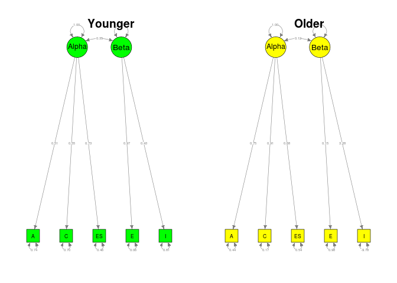
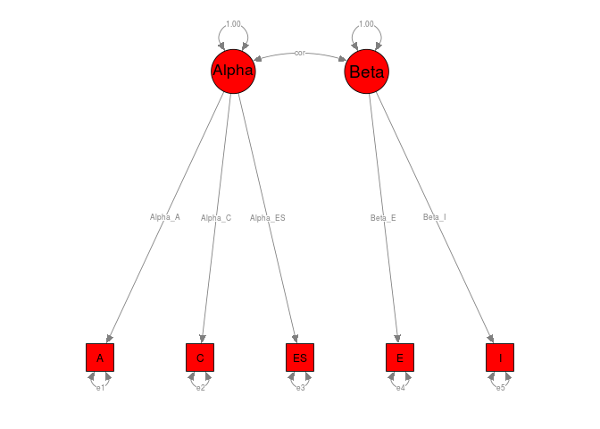
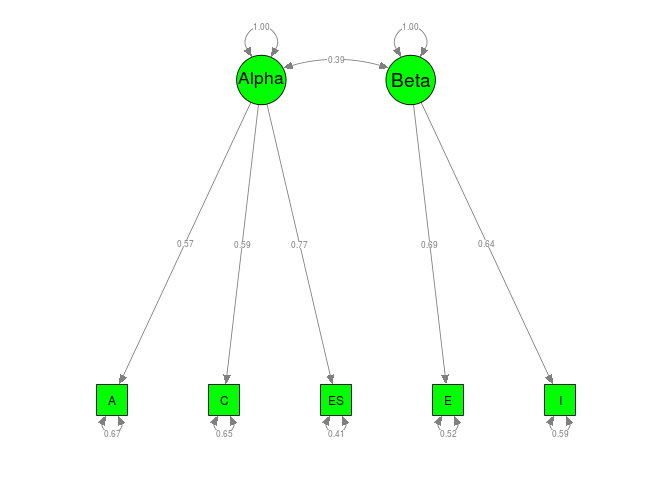
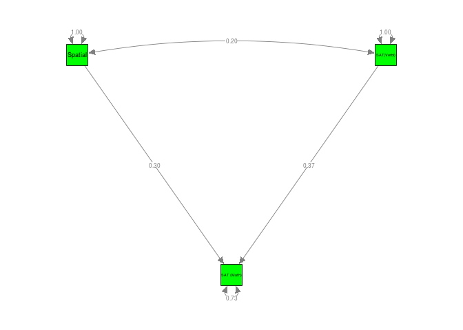

# Examples of MASEM
Mike Cheung  
`r format(Sys.time(), '%d %B, %Y')`  


# Digman (1997)
## Inspect the data
The correlation matrices and the sample sizes were stored in `Digman97$data` and `Digman97$n`, respectively. We may list the first few cases of the data by using the `head()` command.

```r
  #### Load the metaSEM library for TSSEM
  library(metaSEM)
  
  #### Inspect the data for inspection
  head(Digman97$data)
```

```
$`Digman 1 (1994)`
       A     C   ES     E    I
A   1.00  0.62 0.41 -0.48 0.00
C   0.62  1.00 0.59 -0.10 0.35
ES  0.41  0.59 1.00  0.27 0.41
E  -0.48 -0.10 0.27  1.00 0.37
I   0.00  0.35 0.41  0.37 1.00

$`Digman 2 (1994)`
       A    C   ES     E     I
A   1.00 0.39 0.53 -0.30 -0.05
C   0.39 1.00 0.59  0.07  0.44
ES  0.53 0.59 1.00  0.09  0.22
E  -0.30 0.07 0.09  1.00  0.45
I  -0.05 0.44 0.22  0.45  1.00

$`Digman 3 (1963c)`
      A     C   ES     E    I
A  1.00  0.65 0.35  0.25 0.14
C  0.65  1.00 0.37 -0.10 0.33
ES 0.35  0.37 1.00  0.24 0.41
E  0.25 -0.10 0.24  1.00 0.41
I  0.14  0.33 0.41  0.41 1.00

$`Digman & Takemoto-Chock (1981b)`
       A     C   ES     E     I
A   1.00  0.65 0.70 -0.26 -0.03
C   0.65  1.00 0.71 -0.16  0.24
ES  0.70  0.71 1.00  0.01  0.11
E  -0.26 -0.16 0.01  1.00  0.66
I  -0.03  0.24 0.11  0.66  1.00

$`Graziano & Ward (1992)`
      A    C   ES    E    I
A  1.00 0.64 0.35 0.29 0.22
C  0.64 1.00 0.27 0.16 0.22
ES 0.35 0.27 1.00 0.32 0.36
E  0.29 0.16 0.32 1.00 0.53
I  0.22 0.22 0.36 0.53 1.00

$`Yik & Bond (1993)`
      A    C   ES    E    I
A  1.00 0.66 0.57 0.35 0.38
C  0.66 1.00 0.45 0.20 0.31
ES 0.57 0.45 1.00 0.49 0.31
E  0.35 0.20 0.49 1.00 0.59
I  0.38 0.31 0.31 0.59 1.00
```

```r
  head(Digman97$n)
```

```
[1] 102 149 334 162  91 656
```

## Fixed-effects TSSEM
### Stage 1 analysis
To conduct a fixed-effects TSSEM, we may specify `method=FEM` argument (the default method) in calling the `tssem1()` function. The results are stored in an object named `fixed1`. It can be displayed by the `summary()` command. The $\chi^2(130, N=4,496) = 1,499.73, p < .001$, CFI=0.6825, RMSEA=0.1812 and SRMR=0.1750. Based on the test statistic and the goodness-of-fit indices, the assumption of homogeneity of correlation matrices was rejected. 

```r
## Fixed-effects model: Stage 1 analysis
fixed1 <- tssem1(my.df=Digman97$data, n=Digman97$n, method="FEM")
summary(fixed1)
```

```

Call:
tssem1FEM(my.df = my.df, n = n, cor.analysis = cor.analysis, 
    model.name = model.name, cluster = cluster, suppressWarnings = suppressWarnings, 
    silent = silent, run = run)

Coefficients:
       Estimate Std.Error z value  Pr(>|z|)    
S[1,2] 0.363278  0.013367 27.1764 < 2.2e-16 ***
S[1,3] 0.390375  0.012880 30.3081 < 2.2e-16 ***
S[1,4] 0.103572  0.015047  6.8831 5.858e-12 ***
S[1,5] 0.092286  0.015047  6.1331 8.617e-10 ***
S[2,3] 0.416070  0.012519 33.2349 < 2.2e-16 ***
S[2,4] 0.135148  0.014776  9.1465 < 2.2e-16 ***
S[2,5] 0.141431  0.014866  9.5136 < 2.2e-16 ***
S[3,4] 0.244459  0.014153 17.2725 < 2.2e-16 ***
S[3,5] 0.138339  0.014834  9.3260 < 2.2e-16 ***
S[4,5] 0.424566  0.012376 34.3070 < 2.2e-16 ***
---
Signif. codes:  0 '***' 0.001 '**' 0.01 '*' 0.05 '.' 0.1 ' ' 1

Goodness-of-fit indices:
                                     Value
Sample size                      4496.0000
Chi-square of target model       1505.4443
DF of target model                130.0000
p value of target model             0.0000
Chi-square of independence model 4471.4242
DF of independence model          140.0000
RMSEA                               0.1815
RMSEA lower 95% CI                  0.1736
RMSEA upper 95% CI                  0.1901
SRMR                                0.1621
TLI                                 0.6580
CFI                                 0.6824
AIC                              1245.4443
BIC                               412.0217
OpenMx status1: 0 ("0" or "1": The optimization is considered fine.
Other values may indicate problems.)
```

The pooled correlation matrix (the parameter estimates) can be extracted by the use of the `coef()` command.

```r
coef(fixed1)
```

```
            A         C        ES         E          I
A  1.00000000 0.3632782 0.3903748 0.1035716 0.09228557
C  0.36327824 1.0000000 0.4160695 0.1351477 0.14143058
ES 0.39037483 0.4160695 1.0000000 0.2444593 0.13833895
E  0.10357155 0.1351477 0.2444593 1.0000000 0.42456626
I  0.09228557 0.1414306 0.1383390 0.4245663 1.00000000
```

### Stage 2 analysis
As an illustration, I continued to fit the structural model based on the pooled correlation matrix. We may specify the two-factor model with the [RAM formulation](http://openmx.psyc.virginia.edu/docs/OpenMx/latest/Examples_Matrix.html)

```r
## Factor covariance among latent factors
Phi <- matrix(c(1,"0.3*cor","0.3*cor",1), ncol=2, nrow=2)

## Error covariance matrix
Psi <- Diag(c("0.2*e1","0.2*e2","0.2*e3","0.2*e4","0.2*e5"))

## S matrix
S1 <- bdiagMat(list(Psi, Phi))

## This step is not necessary but it is useful for inspecting the model.
dimnames(S1)[[1]] <- dimnames(S1)[[2]] <- c("A","C","ES","E","I","Alpha","Beta") 

## Display S1
S1
```

```
      A        C        ES       E        I        Alpha     Beta     
A     "0.2*e1" "0"      "0"      "0"      "0"      "0"       "0"      
C     "0"      "0.2*e2" "0"      "0"      "0"      "0"       "0"      
ES    "0"      "0"      "0.2*e3" "0"      "0"      "0"       "0"      
E     "0"      "0"      "0"      "0.2*e4" "0"      "0"       "0"      
I     "0"      "0"      "0"      "0"      "0.2*e5" "0"       "0"      
Alpha "0"      "0"      "0"      "0"      "0"      "1"       "0.3*cor"
Beta  "0"      "0"      "0"      "0"      "0"      "0.3*cor" "1"      
```

```r
## A matrix
Lambda <-
matrix(c(".3*Alpha_A",".3*Alpha_C",".3*Alpha_ES",rep(0,5),".3*Beta_E",".3*Beta_I"),
       ncol=2, nrow=5)
A1 <- rbind( cbind(matrix(0,ncol=5,nrow=5), Lambda),
             matrix(0, ncol=7, nrow=2) )

## This step is not necessary but it is useful for inspecting the model.
dimnames(A1)[[1]] <- dimnames(A1)[[2]] <- c("A","C","ES","E","I","Alpha","Beta") 

## Display A1
A1
```

```
      A   C   ES  E   I   Alpha         Beta       
A     "0" "0" "0" "0" "0" ".3*Alpha_A"  "0"        
C     "0" "0" "0" "0" "0" ".3*Alpha_C"  "0"        
ES    "0" "0" "0" "0" "0" ".3*Alpha_ES" "0"        
E     "0" "0" "0" "0" "0" "0"           ".3*Beta_E"
I     "0" "0" "0" "0" "0" "0"           ".3*Beta_I"
Alpha "0" "0" "0" "0" "0" "0"           "0"        
Beta  "0" "0" "0" "0" "0" "0"           "0"        
```

```r
## F matrix to select the observed variables
F1 <- create.Fmatrix(c(1,1,1,1,1,0,0), as.mxMatrix=FALSE)

## Display F1
F1
```

```
     [,1] [,2] [,3] [,4] [,5] [,6] [,7]
[1,]    1    0    0    0    0    0    0
[2,]    0    1    0    0    0    0    0
[3,]    0    0    1    0    0    0    0
[4,]    0    0    0    1    0    0    0
[5,]    0    0    0    0    1    0    0
```
 
Since we are conducting a correlation structure analysis, the error variances are not free parameters. We need to use the `diag.constraints` to constrain the diagonals as one. When there are nonlinear constraints, standard errors are not available in `OpenMx`. We may request the likelihood-based confidence intervals (LBCI) with the `intervals` argument.
The chi-square test statistic of the Stage 2 analysis was $\chi^2(4, N=4,496) = 65.06, p < .001$, CFI=0.9802, RMSEA=0.0583 and SRMR=0.0284.

```r
fixed2 <- tssem2(fixed1, Amatrix=A1, Smatrix=S1, Fmatrix=F1, 
                 diag.constraints=TRUE, intervals="LB",
                 model.name="TSSEM2 Digman97")
summary(fixed2)
```

```

Call:
wls(Cov = coef.tssem1FEM(tssem1.obj), asyCov = vcov.tssem1FEM(tssem1.obj), 
    n = sum(tssem1.obj$n), Amatrix = Amatrix, Smatrix = Smatrix, 
    Fmatrix = Fmatrix, diag.constraints = diag.constraints, cor.analysis = tssem1.obj$cor.analysis, 
    intervals.type = intervals.type, mx.algebras = mx.algebras, 
    model.name = model.name, suppressWarnings = suppressWarnings, 
    silent = silent, run = run)

95% confidence intervals: Likelihood-based statistic
Coefficients:
         Estimate Std.Error  lbound  ubound z value Pr(>|z|)
Alpha_A   0.56280        NA 0.53267 0.59302      NA       NA
Alpha_C   0.60522        NA 0.57524 0.63535      NA       NA
Alpha_ES  0.71920        NA 0.68876 0.75032      NA       NA
Beta_E    0.78141        NA 0.71854 0.85503      NA       NA
Beta_I    0.55137        NA 0.49996 0.60273      NA       NA
e1        0.68326        NA 0.64833 0.71623      NA       NA
e2        0.63371        NA 0.59633 0.66912      NA       NA
e3        0.48275        NA 0.43701 0.52563      NA       NA
e4        0.38939        NA 0.26901 0.48349      NA       NA
e5        0.69599        NA 0.63671 0.75022      NA       NA
cor       0.36268        NA 0.31858 0.40646      NA       NA

Goodness-of-fit indices:
                                               Value
Sample size                                4496.0000
Chi-square of target model                   65.4521
DF of target model                            4.0000
p value of target model                       0.0000
Number of constraints imposed on "Smatrix"    5.0000
DF manually adjusted                          0.0000
Chi-square of independence model           3112.9064
DF of independence model                     10.0000
RMSEA                                         0.0585
RMSEA lower 95% CI                            0.0465
RMSEA upper 95% CI                            0.0713
SRMR                                          0.0284
TLI                                           0.9505
CFI                                           0.9802
AIC                                          57.4521
BIC                                          31.8083
OpenMx status1: 0 ("0" or "1": The optimization is considered fine.
Other values indicate problems.)
```

## Fixed-effects TSSEM with cluster
### Stage 1 analysis
There are 4 types of sample characteristics in the original `cluster`. We may group them into either younger or older samples. 

```r
#### Display the frequencies of "cluster"
table(Digman97$cluster)
```

```

  Adolescents      Children Mature adults  Young adults 
            1             4             6             3 
```

```r
#### Fixed-effects TSSEM with several clusters
#### Create a variable for different cluster
#### Younger participants: Children and Adolescents
#### Older participants: others
clusters <- ifelse(Digman97$cluster %in% c("Children","Adolescents"),
                   yes="Younger participants", no="Older participants")
  
#### Show the clusters
clusters
```

```
 [1] "Younger participants" "Younger participants" "Younger participants"
 [4] "Younger participants" "Younger participants" "Older participants"  
 [7] "Older participants"   "Older participants"   "Older participants"  
[10] "Older participants"   "Older participants"   "Older participants"  
[13] "Older participants"   "Older participants"  
```

We may conduct a fixed-effects model by specifying the `cluster=clusters` argument. Fixed-effects TSSEM will be conducted according to the labels in the `clusters`. The goodness-of-fit indices of the Stage 1 analysis for the older and younger participants were $\chi^2(80, N=3,658) = 823.88, p < .001$, CFI=0.7437, RMSEA=0.1513 and SRMR=0.1528, and $\chi^2(40, N=838) = 344.18, p < .001$, CFI=0.7845, RMSEA=0.2131 and SRMR=0.1508, respectively. 

```r
## Example of Fixed-effects TSSEM with several clusters
cluster1 <- tssem1(Digman97$data, Digman97$n, method="FEM", 
                   cluster=clusters)
summary(cluster1)
```

```
$`Older participants`

Call:
tssem1FEM(my.df = data.cluster[[i]], n = n.cluster[[i]], cor.analysis = cor.analysis, 
    model.name = model.name, suppressWarnings = suppressWarnings)

Coefficients:
       Estimate Std.Error z value  Pr(>|z|)    
S[1,2] 0.297471  0.015436 19.2717 < 2.2e-16 ***
S[1,3] 0.370248  0.014532 25.4775 < 2.2e-16 ***
S[1,4] 0.137694  0.016403  8.3944 < 2.2e-16 ***
S[1,5] 0.098061  0.016724  5.8636 4.528e-09 ***
S[2,3] 0.393692  0.014146 27.8308 < 2.2e-16 ***
S[2,4] 0.183045  0.016055 11.4009 < 2.2e-16 ***
S[2,5] 0.092774  0.016643  5.5743 2.485e-08 ***
S[3,4] 0.260753  0.015554 16.7645 < 2.2e-16 ***
S[3,5] 0.096141  0.016574  5.8009 6.597e-09 ***
S[4,5] 0.411756  0.013900 29.6225 < 2.2e-16 ***
---
Signif. codes:  0 '***' 0.001 '**' 0.01 '*' 0.05 '.' 0.1 ' ' 1

Goodness-of-fit indices:
                                     Value
Sample size                      3658.0000
Chi-square of target model        825.9826
DF of target model                 80.0000
p value of target model             0.0000
Chi-square of independence model 3000.9731
DF of independence model           90.0000
RMSEA                               0.1515
RMSEA lower 95% CI                  0.1424
RMSEA upper 95% CI                  0.1611
SRMR                                0.1459
TLI                                 0.7117
CFI                                 0.7437
AIC                               665.9826
BIC                               169.6088
OpenMx status1: 0 ("0" or "1": The optimization is considered fine.
Other values may indicate problems.)

$`Younger participants`

Call:
tssem1FEM(my.df = data.cluster[[i]], n = n.cluster[[i]], cor.analysis = cor.analysis, 
    model.name = model.name, suppressWarnings = suppressWarnings)

Coefficients:
        Estimate Std.Error z value  Pr(>|z|)    
S[1,2]  0.604330  0.022125 27.3138 < 2.2e-16 ***
S[1,3]  0.465536  0.027493 16.9326 < 2.2e-16 ***
S[1,4] -0.031381  0.035940 -0.8731   0.38259    
S[1,5]  0.061508  0.034547  1.7804   0.07501 .  
S[2,3]  0.501432  0.026348 19.0309 < 2.2e-16 ***
S[2,4] -0.060678  0.034558 -1.7559   0.07911 .  
S[2,5]  0.320987  0.031064 10.3329 < 2.2e-16 ***
S[3,4]  0.175437  0.033675  5.2097 1.892e-07 ***
S[3,5]  0.305149  0.031586  9.6608 < 2.2e-16 ***
S[4,5]  0.478640  0.026883 17.8045 < 2.2e-16 ***
---
Signif. codes:  0 '***' 0.001 '**' 0.01 '*' 0.05 '.' 0.1 ' ' 1

Goodness-of-fit indices:
                                     Value
Sample size                       838.0000
Chi-square of target model        346.2810
DF of target model                 40.0000
p value of target model             0.0000
Chi-square of independence model 1470.4511
DF of independence model           50.0000
RMSEA                               0.2139
RMSEA lower 95% CI                  0.1939
RMSEA upper 95% CI                  0.2355
SRMR                                0.1411
TLI                                 0.7305
CFI                                 0.7844
AIC                               266.2810
BIC                                77.0402
OpenMx status1: 0 ("0" or "1": The optimization is considered fine.
Other values may indicate problems.)
```

The pooled correlation matrix for each cluster can be extracted by the use of the =coef()= command.

```r
coef(cluster1)
```

```
$`Older participants`
            A          C         ES         E          I
A  1.00000000 0.29747123 0.37024803 0.1376942 0.09806125
C  0.29747123 1.00000000 0.39369157 0.1830450 0.09277411
ES 0.37024803 0.39369157 1.00000000 0.2607530 0.09614072
E  0.13769424 0.18304500 0.26075304 1.0000000 0.41175622
I  0.09806125 0.09277411 0.09614072 0.4117562 1.00000000

$`Younger participants`
             A          C        ES          E          I
A   1.00000000  0.6043300 0.4655359 -0.0313810 0.06150839
C   0.60433002  1.0000000 0.5014319 -0.0606784 0.32098713
ES  0.46553592  0.5014319 1.0000000  0.1754367 0.30514853
E  -0.03138100 -0.0606784 0.1754367  1.0000000 0.47864004
I   0.06150839  0.3209871 0.3051485  0.4786400 1.00000000
```

### Stage 2 analysis
The goodness-of-fit indices of the Stage 2 analysis for the older and younger participants were $\chi^2(4, N=3,658) = 21.92, p < .001$, CFI=0.9921, RMSEA=0.0350 and SRMR=0.0160, and $\chi^2(4, N=838) = 144.87, p < .001$, CFI=0.9427, RMSEA=0.2051 and SRMR=0.1051, respectively. 

```r
cluster2 <- tssem2(cluster1, Amatrix=A1, Smatrix=S1, Fmatrix=F1, 
                   diag.constraints=TRUE, intervals.type="z")
#### Please note that the estimates for the younger participants are problematic.
summary(cluster2)
```

```
Warning in vcov.wls(object, R = R): Parametric bootstrap with 50 replications was used to approximate the sampling covariance matrix of the parameter estimates. A better approach is to use likelihood-based confidence interval by including the intervals.type="LB" argument in the analysis.

Warning in vcov.wls(object, R = R): Parametric bootstrap with 50 replications was used to approximate the sampling covariance matrix of the parameter estimates. A better approach is to use likelihood-based confidence interval by including the intervals.type="LB" argument in the analysis.
```

```
$`Older participants`

Call:
wls(Cov = coef.tssem1FEM(tssem1.obj), asyCov = vcov.tssem1FEM(tssem1.obj), 
    n = sum(tssem1.obj$n), Amatrix = Amatrix, Smatrix = Smatrix, 
    Fmatrix = Fmatrix, diag.constraints = diag.constraints, cor.analysis = tssem1.obj$cor.analysis, 
    intervals.type = intervals.type, mx.algebras = mx.algebras, 
    model.name = model.name, suppressWarnings = suppressWarnings, 
    silent = silent, run = run)

95% confidence intervals: z statistic approximation
Coefficients:
          Estimate Std.Error    lbound    ubound z value Pr(>|z|)    
Alpha_A   0.512656  0.020807  0.471875  0.553437 24.6387   <2e-16 ***
Alpha_C   0.549967  0.020503  0.509782  0.590152 26.8238   <2e-16 ***
Alpha_ES  0.732173  0.016625  0.699590  0.764757 44.0415   <2e-16 ***
Beta_E    0.967137  0.066308  0.837175  1.097098 14.5855   <2e-16 ***
Beta_I    0.430648  0.030387  0.371091  0.490206 14.1721   <2e-16 ***
e1        0.737184  0.021255  0.695525  0.778843 34.6827   <2e-16 ***
e2        0.697536  0.022287  0.653854  0.741219 31.2974   <2e-16 ***
e3        0.463922  0.024632  0.415645  0.512199 18.8345   <2e-16 ***
e4        0.064646  0.132357 -0.194769  0.324062  0.4884   0.6253    
e5        0.814542  0.025836  0.763905  0.865179 31.5278   <2e-16 ***
cor       0.349235  0.027080  0.296160  0.402310 12.8966   <2e-16 ***
---
Signif. codes:  0 '***' 0.001 '**' 0.01 '*' 0.05 '.' 0.1 ' ' 1

Goodness-of-fit indices:
                                               Value
Sample size                                3658.0000
Chi-square of target model                   21.9955
DF of target model                            4.0000
p value of target model                       0.0002
Number of constraints imposed on "Smatrix"    5.0000
DF manually adjusted                          0.0000
Chi-square of independence model           2273.3348
DF of independence model                     10.0000
RMSEA                                         0.0351
RMSEA lower 95% CI                            0.0217
RMSEA upper 95% CI                            0.0500
SRMR                                          0.0160
TLI                                           0.9801
CFI                                           0.9920
AIC                                          13.9955
BIC                                         -10.8232
OpenMx status1: 0 ("0" or "1": The optimization is considered fine.
Other values indicate problems.)

$`Younger participants`

Call:
wls(Cov = coef.tssem1FEM(tssem1.obj), asyCov = vcov.tssem1FEM(tssem1.obj), 
    n = sum(tssem1.obj$n), Amatrix = Amatrix, Smatrix = Smatrix, 
    Fmatrix = Fmatrix, diag.constraints = diag.constraints, cor.analysis = tssem1.obj$cor.analysis, 
    intervals.type = intervals.type, mx.algebras = mx.algebras, 
    model.name = model.name, suppressWarnings = suppressWarnings, 
    silent = silent, run = run)

95% confidence intervals: z statistic approximation
Coefficients:
            Estimate   Std.Error      lbound      ubound z value  Pr(>|z|)
Alpha_A   7.4765e-01  3.0120e-02  6.8861e-01  8.0668e-01 24.8224 < 2.2e-16
Alpha_C   9.1170e-01  2.0758e-02  8.7102e-01  9.5239e-01 43.9205 < 2.2e-16
Alpha_ES  6.7744e-01  2.7205e-02  6.2411e-01  7.3076e-01 24.9008 < 2.2e-16
Beta_E    1.5258e-01  1.1829e-01 -7.9271e-02  3.8443e-01  1.2899    0.1971
Beta_I    3.2834e+00  2.1744e+02 -4.2288e+02  4.2945e+02  0.0151    0.9880
e1        4.4102e-01  4.5340e-02  3.5216e-01  5.2989e-01  9.7269 < 2.2e-16
e2        1.6879e-01  3.7936e-02  9.4441e-02  2.4315e-01  4.4495 8.608e-06
e3        5.4108e-01  3.6878e-02  4.6880e-01  6.1336e-01 14.6720 < 2.2e-16
e4        9.7672e-01  3.6639e-02  9.0491e-01  1.0485e+00 26.6577 < 2.2e-16
e5       -9.7810e+00  1.2346e+05 -2.4199e+05  2.4197e+05 -0.0001    0.9999
cor       1.1727e-01  9.0083e-02 -5.9287e-02  2.9383e-01  1.3018    0.1930
            
Alpha_A  ***
Alpha_C  ***
Alpha_ES ***
Beta_E      
Beta_I      
e1       ***
e2       ***
e3       ***
e4       ***
e5          
cor         
---
Signif. codes:  0 '***' 0.001 '**' 0.01 '*' 0.05 '.' 0.1 ' ' 1

Goodness-of-fit indices:
                                               Value
Sample size                                 838.0000
Chi-square of target model                  145.6174
DF of target model                            4.0000
p value of target model                       0.0000
Number of constraints imposed on "Smatrix"    5.0000
DF manually adjusted                          0.0000
Chi-square of independence model           2480.1661
DF of independence model                     10.0000
RMSEA                                         0.2057
RMSEA lower 95% CI                            0.1778
RMSEA upper 95% CI                            0.2350
SRMR                                          0.1051
TLI                                           0.8567
CFI                                           0.9427
AIC                                         137.6174
BIC                                         118.6933
OpenMx status1: 0 ("0" or "1": The optimization is considered fine.
Other values indicate problems.)
```

We may also plot the parameter estimates of these two groups.

```r
library(semPlot)

## Convert the model to semPlotModel object with 2 plots
my.plots <- lapply(X=cluster2, FUN=meta2semPlot, latNames=c("Alpha","Beta"))

## Setup two plots
layout(t(1:2))
semPaths(my.plots[[1]], whatLabels="est", nCharNodes=10, color="green")
title("Younger") 
semPaths(my.plots[[2]], whatLabels="est", nCharNodes=10, color="yellow")
title("Older")
```



## Random-effects TSSEM
### Stage 1 analysis
Since there is not enough data to estimate the full variance component of the random effects, I estimate the variance component with a diagonal matrix in the `RE.type="Diag"` argument. The range of $I^2$ indices, the percentage of total variance that can be explained by the between study effect, are from .84 to .95. 

```r
#### Random-effects TSSEM with random effects on the diagonals
random1 <- tssem1(Digman97$data, Digman97$n, method="REM",
                  RE.type="Diag")
summary(random1)
```

```

Call:
meta(y = ES, v = acovR, RE.constraints = Diag(x = paste(RE.startvalues, 
    "*Tau2_", 1:no.es, "_", 1:no.es, sep = "")), RE.lbound = RE.lbound, 
    I2 = I2, model.name = model.name, suppressWarnings = TRUE, 
    silent = silent, run = run)

95% confidence intervals: z statistic approximation
Coefficients:
               Estimate   Std.Error      lbound      ubound z value
Intercept1   3.9460e-01  5.4212e-02  2.8835e-01  5.0085e-01  7.2789
Intercept2   4.4005e-01  4.1241e-02  3.5922e-01  5.2088e-01 10.6701
Intercept3   5.4509e-02  6.1730e-02 -6.6479e-02  1.7550e-01  0.8830
Intercept4   9.8644e-02  4.6202e-02  8.0884e-03  1.8920e-01  2.1350
Intercept5   4.2958e-01  4.0146e-02  3.5090e-01  5.0827e-01 10.7004
Intercept6   1.2851e-01  4.0839e-02  4.8472e-02  2.0856e-01  3.1469
Intercept7   2.0521e-01  4.9554e-02  1.0809e-01  3.0233e-01  4.1411
Intercept8   2.3988e-01  3.1927e-02  1.7730e-01  3.0245e-01  7.5134
Intercept9   1.8907e-01  4.2998e-02  1.0480e-01  2.7335e-01  4.3972
Intercept10  4.4403e-01  3.2524e-02  3.8029e-01  5.0778e-01 13.6524
Tau2_1_1     3.7222e-02  1.5000e-02  7.8227e-03  6.6621e-02  2.4815
Tau2_2_2     2.0313e-02  8.4334e-03  3.7838e-03  3.6842e-02  2.4086
Tau2_3_3     4.8285e-02  1.9739e-02  9.5972e-03  8.6972e-02  2.4462
Tau2_4_4     2.4629e-02  1.0625e-02  3.8049e-03  4.5453e-02  2.3181
Tau2_5_5     1.8744e-02  8.2474e-03  2.5796e-03  3.4909e-02  2.2727
Tau2_6_6     1.8317e-02  8.8016e-03  1.0660e-03  3.5568e-02  2.0811
Tau2_7_7     2.9412e-02  1.2252e-02  5.3988e-03  5.3424e-02  2.4006
Tau2_8_8     9.6824e-03  4.8934e-03  9.1508e-05  1.9273e-02  1.9787
Tau2_9_9     2.0950e-02  9.1284e-03  3.0588e-03  3.8842e-02  2.2951
Tau2_10_10   1.1156e-02  5.0453e-03  1.2672e-03  2.1044e-02  2.2111
             Pr(>|z|)    
Intercept1  3.366e-13 ***
Intercept2  < 2.2e-16 ***
Intercept3    0.37722    
Intercept4    0.03276 *  
Intercept5  < 2.2e-16 ***
Intercept6    0.00165 ** 
Intercept7  3.456e-05 ***
Intercept8  5.751e-14 ***
Intercept9  1.097e-05 ***
Intercept10 < 2.2e-16 ***
Tau2_1_1      0.01308 *  
Tau2_2_2      0.01601 *  
Tau2_3_3      0.01444 *  
Tau2_4_4      0.02044 *  
Tau2_5_5      0.02304 *  
Tau2_6_6      0.03743 *  
Tau2_7_7      0.01637 *  
Tau2_8_8      0.04785 *  
Tau2_9_9      0.02173 *  
Tau2_10_10    0.02703 *  
---
Signif. codes:  0 '***' 0.001 '**' 0.01 '*' 0.05 '.' 0.1 ' ' 1

Q statistic on the homogeneity of effect sizes: 2390.052
Degrees of freedom of the Q statistic: 130
P value of the Q statistic: 0

Heterogeneity indices (based on the estimated Tau2):
                              Estimate
Intercept1: I2 (Q statistic)    0.9489
Intercept2: I2 (Q statistic)    0.9085
Intercept3: I2 (Q statistic)    0.9417
Intercept4: I2 (Q statistic)    0.8898
Intercept5: I2 (Q statistic)    0.9009
Intercept6: I2 (Q statistic)    0.8545
Intercept7: I2 (Q statistic)    0.9096
Intercept8: I2 (Q statistic)    0.7726
Intercept9: I2 (Q statistic)    0.8751
Intercept10: I2 (Q statistic)   0.8437

Number of studies (or clusters): 14
Number of observed statistics: 140
Number of estimated parameters: 20
Degrees of freedom: 120
-2 log likelihood: -110.8764 
OpenMx status1: 0 ("0" or "1": The optimization is considered fine.
Other values may indicate problems.)
```

The pooled correlation coefficients (fixed effects) and the variance components (the random effects) can be extracted by the use of the `coef()` command via the `select` argument.

```r
## Fixed effects
coef(random1, select="fixed")
```

```
 Intercept1  Intercept2  Intercept3  Intercept4  Intercept5  Intercept6 
 0.39459999  0.44005201  0.05450942  0.09864354  0.42958326  0.12851430 
 Intercept7  Intercept8  Intercept9 Intercept10 
 0.20521009  0.23987945  0.18907142  0.44403320 
```

```r
## Random effects
coef(random1, select="random")
```

```
   Tau2_1_1    Tau2_2_2    Tau2_3_3    Tau2_4_4    Tau2_5_5    Tau2_6_6 
0.037222059 0.020313026 0.048284535 0.024629148 0.018744111 0.018316939 
   Tau2_7_7    Tau2_8_8    Tau2_9_9  Tau2_10_10 
0.029411543 0.009682373 0.020950191 0.011155798 
```

### Stage 2 analysis
The steps are exactly the same as those in the fixed-effects model. The chi-square test statistic of the Stage 2 analysis was $\chi^2(4, N=4,496) = 8.51, p < .001$, CFI=0.9911, RMSEA=0.0158 and SRMR=0.0463. 

```r
random2 <- tssem2(random1, Amatrix=A1, Smatrix=S1, Fmatrix=F1, 
                  diag.constraints=TRUE, intervals="LB")
summary(random2)
```

```

Call:
wls(Cov = pooledS, asyCov = asyCov, n = tssem1.obj$total.n, Amatrix = Amatrix, 
    Smatrix = Smatrix, Fmatrix = Fmatrix, diag.constraints = diag.constraints, 
    cor.analysis = cor.analysis, intervals.type = intervals.type, 
    mx.algebras = mx.algebras, model.name = model.name, suppressWarnings = suppressWarnings, 
    silent = silent, run = run)

95% confidence intervals: Likelihood-based statistic
Coefficients:
         Estimate Std.Error  lbound  ubound z value Pr(>|z|)
Alpha_A   0.57255        NA 0.47380 0.67681      NA       NA
Alpha_C   0.59013        NA 0.49058 0.69480      NA       NA
Alpha_ES  0.77030        NA 0.65984 0.79384      NA       NA
Beta_E    0.69329        NA 0.56260      NA      NA       NA
Beta_I    0.64007        NA 0.50847 0.78612      NA       NA
e1        0.67218        NA 0.54195 0.77555      NA       NA
e2        0.65175        NA 0.51718 0.75934      NA       NA
e3        0.40664        NA 0.18850 0.56458      NA       NA
e4        0.51935        NA 0.40569 0.68393      NA       NA
e5        0.59031        NA 0.46535 0.74156      NA       NA
cor       0.39366        NA 0.30246 0.49017      NA       NA

Goodness-of-fit indices:
                                               Value
Sample size                                4496.0000
Chi-square of target model                    8.5069
DF of target model                            4.0000
p value of target model                       0.0747
Number of constraints imposed on "Smatrix"    5.0000
DF manually adjusted                          0.0000
Chi-square of independence model            515.0233
DF of independence model                     10.0000
RMSEA                                         0.0158
RMSEA lower 95% CI                            0.0000
RMSEA upper 95% CI                            0.0308
SRMR                                          0.0463
TLI                                           0.9777
CFI                                           0.9911
AIC                                           0.5069
BIC                                         -25.1369
OpenMx status1: 0 ("0" or "1": The optimization is considered fine.
Other values indicate problems.)
```

We may also plot the models with the labels or the parameter estimates.

```r
library(semPlot)

## Convert the model to semPlotModel object
my.plot <- meta2semPlot(random2, latNames=c("Alpha","Beta"))

## Plot the model with labels
semPaths(my.plot, whatLabels="path", nCharEdges=10, nCharNodes=10, color="red")
```



```r
## Plot the parameter estimates
semPaths(my.plot, whatLabels="est", nCharNodes=10, color="green")
```



# Becker and Schram (1994)
## Inspect the data
We may list the first few cases of the data by using the `head()` command.

```r
#### Load the metaSEM library for TSSEM
library(metaSEM)
  
#### Inspect the data for inspection (not required for the analysis)
head(Becker94$data)
```

```
$`Becker (1978) Females`
             SAT (Math) Spatial SAT (Verbal)
SAT (Math)         1.00    0.47        -0.21
Spatial            0.47    1.00        -0.15
SAT (Verbal)      -0.21   -0.15         1.00

$`Becker (1978) Males`
             SAT (Math) Spatial SAT (Verbal)
SAT (Math)         1.00    0.28         0.19
Spatial            0.28    1.00         0.18
SAT (Verbal)       0.19    0.18         1.00

$`Berry (1957) Females`
             SAT (Math) Spatial SAT (Verbal)
SAT (Math)         1.00    0.48         0.41
Spatial            0.48    1.00         0.26
SAT (Verbal)       0.41    0.26         1.00

$`Berry (1957) Males`
             SAT (Math) Spatial SAT (Verbal)
SAT (Math)         1.00    0.37         0.40
Spatial            0.37    1.00         0.27
SAT (Verbal)       0.40    0.27         1.00

$`Rosenberg (1981) Females`
             SAT (Math) Spatial SAT (Verbal)
SAT (Math)         1.00    0.42         0.48
Spatial            0.42    1.00         0.23
SAT (Verbal)       0.48    0.23         1.00

$`Rosenberg (1981) Males`
             SAT (Math) Spatial SAT (Verbal)
SAT (Math)         1.00    0.41         0.74
Spatial            0.41    1.00         0.44
SAT (Verbal)       0.74    0.44         1.00
```

```r
head(Becker94$n)
```

```
[1]  74 153  48  55  51  18
```

## Fixed-effects TSSEM
### Stage 1 analysis
The test statistic of the Stage 1 analysis based on the TSSEM approach was $\chi^2(27, N=538) = 62.50, p < .001$, CFI=0.7943, RMSEA=0.1565 and SRMR=0.2011. Based on the test statistic and the goodness-of-fit indices, the hypothesis of homogeneity of correlation matrices was rejected. 

```r
#### Fixed-effects model
## Stage 1 analysis
fixed1 <- tssem1(Becker94$data, Becker94$n, method="FEM")
summary(fixed1)
```

```

Call:
tssem1FEM(my.df = my.df, n = n, cor.analysis = cor.analysis, 
    model.name = model.name, cluster = cluster, suppressWarnings = suppressWarnings, 
    silent = silent, run = run)

Coefficients:
       Estimate Std.Error z value  Pr(>|z|)    
S[1,2] 0.379961  0.037124 10.2350 < 2.2e-16 ***
S[1,3] 0.334562  0.039947  8.3751 < 2.2e-16 ***
S[2,3] 0.176461  0.042334  4.1683 3.069e-05 ***
---
Signif. codes:  0 '***' 0.001 '**' 0.01 '*' 0.05 '.' 0.1 ' ' 1

Goodness-of-fit indices:
                                     Value
Sample size                       538.0000
Chi-square of target model         63.6553
DF of target model                 27.0000
p value of target model             0.0001
Chi-square of independence model  207.7894
DF of independence model           30.0000
RMSEA                               0.1590
RMSEA lower 95% CI                  0.1096
RMSEA upper 95% CI                  0.2117
SRMR                                0.1586
TLI                                 0.7709
CFI                                 0.7938
AIC                                 9.6553
BIC                              -106.1169
OpenMx status1: 0 ("0" or "1": The optimization is considered fine.
Other values may indicate problems.)
```

```r
coef(fixed1)
```

```
             SAT (Math)   Spatial SAT (Verbal)
SAT (Math)    1.0000000 0.3799605     0.334562
Spatial       0.3799605 1.0000000     0.176461
SAT (Verbal)  0.3345620 0.1764610     1.000000
```

### Stage 2 analysis
We may specify the model via the RAM formulation. If all variables are observed, there is no need to specify the *F* matrix. Since the *df* of the regression model is 0, the proposed model always fits the data perfectly.

```r
#### Prepare models for stage 2 analysis
## A1: asymmetric matrix (regression coefficients)
A1 <- create.mxMatrix(c(0,0,0,"0.2*Spatial2Math",
                        0,0,"0.2*Verbal2Math",0,0), 
                        type="Full", ncol=3, nrow=3, 
                        name="A1")
A1 
```

```
FullMatrix 'A1' 

$labels
     [,1] [,2]           [,3]         
[1,] NA   "Spatial2Math" "Verbal2Math"
[2,] NA   NA             NA           
[3,] NA   NA             NA           

$values
     [,1] [,2] [,3]
[1,]    0  0.2  0.2
[2,]    0  0.0  0.0
[3,]    0  0.0  0.0

$free
      [,1]  [,2]  [,3]
[1,] FALSE  TRUE  TRUE
[2,] FALSE FALSE FALSE
[3,] FALSE FALSE FALSE

$lbound: No lower bounds assigned.

$ubound: No upper bounds assigned.
```

```r
## S1: symmetric matrix (variance covariance matrix among variables)
S1 <- create.mxMatrix(c("0.2*ErrorVarMath",0,0,1,"0.2*CorBetweenSpatialVerbal",1), 
                        type="Symm", name="S1")
S1
```

```
SymmMatrix 'S1' 

$labels
     [,1]           [,2]                      [,3]                     
[1,] "ErrorVarMath" NA                        NA                       
[2,] NA             NA                        "CorBetweenSpatialVerbal"
[3,] NA             "CorBetweenSpatialVerbal" NA                       

$values
     [,1] [,2] [,3]
[1,]  0.2  0.0  0.0
[2,]  0.0  1.0  0.2
[3,]  0.0  0.2  1.0

$free
      [,1]  [,2]  [,3]
[1,]  TRUE FALSE FALSE
[2,] FALSE FALSE  TRUE
[3,] FALSE  TRUE FALSE

$lbound: No lower bounds assigned.

$ubound: No upper bounds assigned.
```

```r
## Stage 2 analysis
fixed2 <- tssem2(fixed1, Amatrix=A1, Smatrix=S1, diag.constraints=TRUE, 
                 intervals="LB")
summary(fixed2)
```

```

Call:
wls(Cov = coef.tssem1FEM(tssem1.obj), asyCov = vcov.tssem1FEM(tssem1.obj), 
    n = sum(tssem1.obj$n), Amatrix = Amatrix, Smatrix = Smatrix, 
    Fmatrix = Fmatrix, diag.constraints = diag.constraints, cor.analysis = tssem1.obj$cor.analysis, 
    intervals.type = intervals.type, mx.algebras = mx.algebras, 
    model.name = model.name, suppressWarnings = suppressWarnings, 
    silent = silent, run = run)

95% confidence intervals: Likelihood-based statistic
Coefficients:
                        Estimate Std.Error   lbound   ubound z value
Spatial2Math            0.331238        NA 0.258215 0.404149      NA
Verbal2Math             0.276111        NA 0.199500 0.352777      NA
ErrorVarMath            0.781766        NA 0.714803 0.840626      NA
CorBetweenSpatialVerbal 0.176461        NA 0.093482 0.259435      NA
                        Pr(>|z|)
Spatial2Math                  NA
Verbal2Math                   NA
ErrorVarMath                  NA
CorBetweenSpatialVerbal       NA

Goodness-of-fit indices:
                                            Value
Sample size                                538.00
Chi-square of target model                   0.00
DF of target model                           0.00
p value of target model                      0.00
Number of constraints imposed on "Smatrix"   1.00
DF manually adjusted                         0.00
Chi-square of independence model           160.47
DF of independence model                     3.00
RMSEA                                        0.00
RMSEA lower 95% CI                           0.00
RMSEA upper 95% CI                           0.00
SRMR                                         0.00
TLI                                          -Inf
CFI                                          1.00
AIC                                          0.00
BIC                                          0.00
OpenMx status1: 0 ("0" or "1": The optimization is considered fine.
Other values indicate problems.)
```

## Fixed-effects TSSEM with cluster
### Stage 1 analysis
The goodness-of-fit indices of the Stage 1 analysis for the female and male participants were $\chi^2(12, N=235) = 42.41, p < .001$, CFI=0.7116, RMSEA=0.2327 and SRMR=0.2339, and $\chi^2(12, N=303) = 16.13, p = .1852$, CFI=0.9385, RMSEA=0.0755 and SRMR=0.1508, respectively.

```r
#### Fixed-effects model with cluster
## Stage 1 analysis
cluster1 <- tssem1(Becker94$data, Becker94$n, method="FEM", cluster=Becker94$gender)
summary(cluster1)
```

```
$Females

Call:
tssem1FEM(my.df = data.cluster[[i]], n = n.cluster[[i]], cor.analysis = cor.analysis, 
    model.name = model.name, suppressWarnings = suppressWarnings)

Coefficients:
       Estimate Std.Error z value  Pr(>|z|)    
S[1,2] 0.455896  0.051992  8.7685 < 2.2e-16 ***
S[1,3] 0.341583  0.061943  5.5144 3.499e-08 ***
S[2,3] 0.171931  0.064731  2.6561  0.007905 ** 
---
Signif. codes:  0 '***' 0.001 '**' 0.01 '*' 0.05 '.' 0.1 ' ' 1

Goodness-of-fit indices:
                                    Value
Sample size                      235.0000
Chi-square of target model        43.1898
DF of target model                12.0000
p value of target model            0.0000
Chi-square of independence model 123.4399
DF of independence model          15.0000
RMSEA                              0.2357
RMSEA lower 95% CI                 0.1637
RMSEA upper 95% CI                 0.3161
SRMR                               0.2141
TLI                                0.6405
CFI                                0.7124
AIC                               19.1898
BIC                              -22.3252
OpenMx status1: 0 ("0" or "1": The optimization is considered fine.
Other values may indicate problems.)

$Males

Call:
tssem1FEM(my.df = data.cluster[[i]], n = n.cluster[[i]], cor.analysis = cor.analysis, 
    model.name = model.name, suppressWarnings = suppressWarnings)

Coefficients:
       Estimate Std.Error z value  Pr(>|z|)    
S[1,2] 0.318051  0.051698  6.1521 7.646e-10 ***
S[1,3] 0.328286  0.052226  6.2859 3.261e-10 ***
S[2,3] 0.179549  0.055944  3.2094   0.00133 ** 
---
Signif. codes:  0 '***' 0.001 '**' 0.01 '*' 0.05 '.' 0.1 ' ' 1

Goodness-of-fit indices:
                                    Value
Sample size                      303.0000
Chi-square of target model        16.4819
DF of target model                12.0000
p value of target model            0.1701
Chi-square of independence model  84.3496
DF of independence model          15.0000
RMSEA                              0.0786
RMSEA lower 95% CI                 0.0000
RMSEA upper 95% CI                 0.1643
SRMR                               0.1025
TLI                                0.9192
CFI                                0.9354
AIC                               -7.5181
BIC                              -52.0829
OpenMx status1: 0 ("0" or "1": The optimization is considered fine.
Other values may indicate problems.)
```

```r
coef(cluster1)
```

```
$Females
             SAT (Math)   Spatial SAT (Verbal)
SAT (Math)    1.0000000 0.4558958    0.3415826
Spatial       0.4558958 1.0000000    0.1719309
SAT (Verbal)  0.3415826 0.1719309    1.0000000

$Males
             SAT (Math)   Spatial SAT (Verbal)
SAT (Math)    1.0000000 0.3180507    0.3282856
Spatial       0.3180507 1.0000000    0.1795489
SAT (Verbal)  0.3282856 0.1795489    1.0000000
```

### Stage 2 analysis

```r
## Stage 2 analysis
cluster2 <- tssem2(cluster1, Amatrix=A1, Smatrix=S1, diag.constraints=TRUE, 
                   intervals="LB")
summary(cluster2)
```

```
$Females

Call:
wls(Cov = coef.tssem1FEM(tssem1.obj), asyCov = vcov.tssem1FEM(tssem1.obj), 
    n = sum(tssem1.obj$n), Amatrix = Amatrix, Smatrix = Smatrix, 
    Fmatrix = Fmatrix, diag.constraints = diag.constraints, cor.analysis = tssem1.obj$cor.analysis, 
    intervals.type = intervals.type, mx.algebras = mx.algebras, 
    model.name = model.name, suppressWarnings = suppressWarnings, 
    silent = silent, run = run)

95% confidence intervals: Likelihood-based statistic
Coefficients:
                        Estimate Std.Error   lbound   ubound z value
Spatial2Math            0.409265        NA 0.305287 0.512539      NA
Verbal2Math             0.271217        NA 0.156124 0.386562      NA
ErrorVarMath            0.720775        NA 0.613550 0.812622      NA
CorBetweenSpatialVerbal 0.171931        NA 0.045058 0.298801      NA
                        Pr(>|z|)
Spatial2Math                  NA
Verbal2Math                   NA
ErrorVarMath                  NA
CorBetweenSpatialVerbal       NA

Goodness-of-fit indices:
                                            Value
Sample size                                235.00
Chi-square of target model                   0.00
DF of target model                           0.00
p value of target model                      0.00
Number of constraints imposed on "Smatrix"   1.00
DF manually adjusted                         0.00
Chi-square of independence model           105.57
DF of independence model                     3.00
RMSEA                                        0.00
RMSEA lower 95% CI                           0.00
RMSEA upper 95% CI                           0.00
SRMR                                         0.00
TLI                                          -Inf
CFI                                          1.00
AIC                                          0.00
BIC                                          0.00
OpenMx status1: 0 ("0" or "1": The optimization is considered fine.
Other values indicate problems.)

$Males

Call:
wls(Cov = coef.tssem1FEM(tssem1.obj), asyCov = vcov.tssem1FEM(tssem1.obj), 
    n = sum(tssem1.obj$n), Amatrix = Amatrix, Smatrix = Smatrix, 
    Fmatrix = Fmatrix, diag.constraints = diag.constraints, cor.analysis = tssem1.obj$cor.analysis, 
    intervals.type = intervals.type, mx.algebras = mx.algebras, 
    model.name = model.name, suppressWarnings = suppressWarnings, 
    silent = silent, run = run)

95% confidence intervals: Likelihood-based statistic
Coefficients:
                        Estimate Std.Error  lbound  ubound z value
Spatial2Math             0.26774        NA 0.16691 0.36855      NA
Verbal2Math              0.28021        NA 0.17802 0.38243      NA
ErrorVarMath             0.82286        NA 0.73600 0.89360      NA
CorBetweenSpatialVerbal  0.17955        NA 0.06990 0.28920      NA
                        Pr(>|z|)
Spatial2Math                  NA
Verbal2Math                   NA
ErrorVarMath                  NA
CorBetweenSpatialVerbal       NA

Goodness-of-fit indices:
                                             Value
Sample size                                303.000
Chi-square of target model                   0.000
DF of target model                           0.000
p value of target model                      0.000
Number of constraints imposed on "Smatrix"   1.000
DF manually adjusted                         0.000
Chi-square of independence model            68.564
DF of independence model                     3.000
RMSEA                                        0.000
RMSEA lower 95% CI                           0.000
RMSEA upper 95% CI                           0.000
SRMR                                         0.000
TLI                                           -Inf
CFI                                          1.000
AIC                                          0.000
BIC                                          0.000
OpenMx status1: 0 ("0" or "1": The optimization is considered fine.
Other values indicate problems.)
```

We may also plot the parameter estimates of these two groups.

```r
## Convert the model to semPlotModel object with 2 plots
my.plots <- lapply(X=cluster2, FUN=meta2semPlot)

## Setup two plots
layout(t(1:2))
semPaths(my.plots[[1]], whatLabels="est", nCharNodes=10, color="green")
title("Females") 
semPaths(my.plots[[2]], whatLabels="est", nCharNodes=10, color="yellow")
title("Males")
```


## Random-effects TSSEM
### Stage 1 analysis
The $I^2$ indices for the correlations between spatial and math, verbal and math, and spatial and verbal are .00, .81 and .23, respectively. 

```r
#### Random-effects model
## Stage 1 analysis: A diagonal matrix for random effects 
random1 <- tssem1(Becker94$data, Becker94$n, method="REM", RE.type="Diag")
summary(random1)
```

```

Call:
meta(y = ES, v = acovR, RE.constraints = Diag(x = paste(RE.startvalues, 
    "*Tau2_", 1:no.es, "_", 1:no.es, sep = "")), RE.lbound = RE.lbound, 
    I2 = I2, model.name = model.name, suppressWarnings = TRUE, 
    silent = silent, run = run)

95% confidence intervals: z statistic approximation
Coefficients:
              Estimate   Std.Error      lbound      ubound z value
Intercept1  3.7179e-01  3.6499e-02  3.0025e-01  4.4333e-01 10.1863
Intercept2  4.3173e-01  7.7452e-02  2.7993e-01  5.8354e-01  5.5742
Intercept3  2.0412e-01  4.6874e-02  1.1224e-01  2.9599e-01  4.3545
Tau2_1_1    1.0000e-10  4.7099e-03 -9.2312e-03  9.2312e-03  0.0000
Tau2_2_2    4.8060e-02  2.6340e-02 -3.5652e-03  9.9685e-02  1.8246
Tau2_3_3    5.8428e-03  9.8463e-03 -1.3455e-02  2.5141e-02  0.5934
            Pr(>|z|)    
Intercept1 < 2.2e-16 ***
Intercept2 2.486e-08 ***
Intercept3 1.333e-05 ***
Tau2_1_1     1.00000    
Tau2_2_2     0.06806 .  
Tau2_3_3     0.55291    
---
Signif. codes:  0 '***' 0.001 '**' 0.01 '*' 0.05 '.' 0.1 ' ' 1

Q statistic on the homogeneity of effect sizes: 83.6582
Degrees of freedom of the Q statistic: 27
P value of the Q statistic: 1.041442e-07

Heterogeneity indices (based on the estimated Tau2):
                             Estimate
Intercept1: I2 (Q statistic)    0.000
Intercept2: I2 (Q statistic)    0.811
Intercept3: I2 (Q statistic)    0.254

Number of studies (or clusters): 10
Number of observed statistics: 30
Number of estimated parameters: 6
Degrees of freedom: 24
-2 log likelihood: -23.66616 
OpenMx status1: 0 ("0" or "1": The optimization is considered fine.
Other values may indicate problems.)
```

```r
coef(random1, select="fixed")
```

```
Intercept1 Intercept2 Intercept3 
 0.3717902  0.4317340  0.2041150 
```

```r
coef(random1, select="random")
```

```
    Tau2_1_1     Tau2_2_2     Tau2_3_3 
0.0000000001 0.0480596685 0.0058428384 
```

### Stage 2 analysis

```r
## Stage 2 analysis
random2 <- tssem2(random1, Amatrix=A1, Smatrix=S1, diag.constraints=TRUE, 
                  intervals="LB")
summary(random2)
```

```

Call:
wls(Cov = pooledS, asyCov = asyCov, n = tssem1.obj$total.n, Amatrix = Amatrix, 
    Smatrix = Smatrix, Fmatrix = Fmatrix, diag.constraints = diag.constraints, 
    cor.analysis = cor.analysis, intervals.type = intervals.type, 
    mx.algebras = mx.algebras, model.name = model.name, suppressWarnings = suppressWarnings, 
    silent = silent, run = run)

95% confidence intervals: Likelihood-based statistic
Coefficients:
                        Estimate Std.Error  lbound  ubound z value
Spatial2Math             0.29600        NA 0.21537 0.37418      NA
Verbal2Math              0.37132        NA 0.21240 0.52949      NA
ErrorVarMath             0.72964        NA 0.58973 0.82994      NA
CorBetweenSpatialVerbal  0.20412        NA 0.11224 0.29599      NA
                        Pr(>|z|)
Spatial2Math                  NA
Verbal2Math                   NA
ErrorVarMath                  NA
CorBetweenSpatialVerbal       NA

Goodness-of-fit indices:
                                            Value
Sample size                                538.00
Chi-square of target model                   0.00
DF of target model                           0.00
p value of target model                      0.00
Number of constraints imposed on "Smatrix"   1.00
DF manually adjusted                         0.00
Chi-square of independence model           132.21
DF of independence model                     3.00
RMSEA                                        0.00
RMSEA lower 95% CI                           0.00
RMSEA upper 95% CI                           0.00
SRMR                                         0.00
TLI                                          -Inf
CFI                                          1.00
AIC                                          0.00
BIC                                          0.00
OpenMx status1: 0 ("0" or "1": The optimization is considered fine.
Other values indicate problems.)
```

We may also plot the models with the labels or the parameter estimates.

```r
## Convert the model to semPlotModel object
my.plot <- meta2semPlot(random2)

## Plot the model with labels
semPaths(my.plot, whatLabels="path", nCharEdges=10, nCharNodes=10, color="red")
```


```r
## Plot the parameter estimates
semPaths(my.plot, whatLabels="est", nCharNodes=10, color="green")
```


